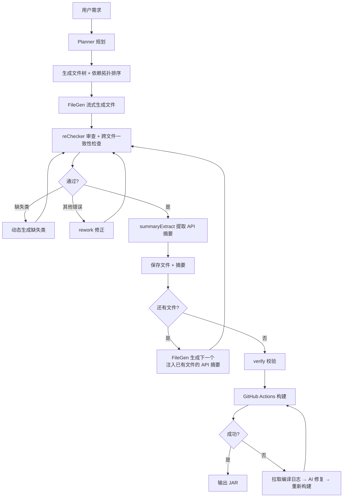
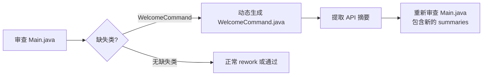
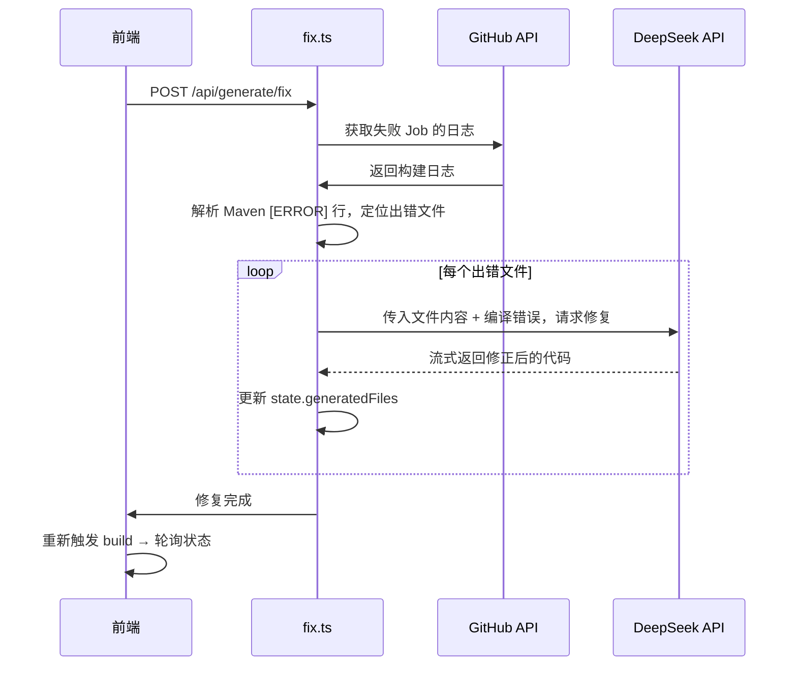

# AI 多阶段工作流

踏海的核心是 AI 驱动的代码生成流程，通过多个专门的 AI 角色协同工作，结合结构化 API 摘要、依赖拓扑排序、SSE 流式输出、动态缺失类补全和编译失败自动修复，保证生成代码的质量和跨文件一致性。

## 整体流程



## 第一阶段：Planner 规划

### 职责

Planner 负责将用户的自然语言需求转换为结构化的项目规划。

### 输入

```json
{
  "userPrompt": "写一个玩家进服时发送欢迎消息的插件",
  "coreType": "PAPER",
  "version": "1.20.6"
}
```

### Prompt 设计

```typescript
const plannerPrompt = `你是 Minecraft 插件项目规划器。
用户需求：${userPrompt}
核心类型：${coreType}
MC 版本：${version}

请生成项目规划，包含：
1. projectName：项目名（驼峰命名）
2. packageName：包名（小写，com.example.xxx）
3. javaVersion：Java 版本（8/11/17/21）
4. files：文件列表，每个文件包含：
   - path：文件路径
   - role：文件职责描述
   - order：生成顺序（数字）
   - depends：依赖的其他文件名数组

输出 JSON 格式。`;
```

### 输出

```json
{
  "projectName": "WelcomePlugin",
  "packageName": "com.example.welcomeplugin",
  "javaVersion": "17",
  "files": [
    {
      "path": "pom.xml",
      "role": "Maven 构建配置",
      "order": 1,
      "depends": []
    },
    {
      "path": "src/main/resources/plugin.yml",
      "role": "插件描述文件",
      "order": 2,
      "depends": []
    },
    {
      "path": "src/main/java/com/example/welcomeplugin/WelcomePlugin.java",
      "role": "插件主类，监听玩家加入事件",
      "order": 3,
      "depends": []
    }
  ]
}
```

### 关键设计

**1. 结构化输出**
- 使用 JSON Mode 强制 AI 输出 JSON
- 避免自然语言描述混入结果

**2. 依赖拓扑排序**
- 每个文件声明 `depends` 字段，列出它依赖的其他文件名
- 服务端使用 Kahn 算法对文件列表进行拓扑排序
- 被依赖的文件先生成，依赖方后生成
- 插件主类（继承 JavaPlugin）始终排在所有 Java 文件最后
- 配置文件优先（pom.xml order=1）

**3. 角色描述**
- 每个文件的 `role` 字段描述职责
- FileGen 生成时作为上下文传入
- 帮助 AI 理解文件的作用

## 第二阶段：FileGen 流式生成

### 职责

FileGen 负责根据 Planner 的规划，逐个生成文件内容。生成过程通过 SSE（Server-Sent Events）实时推送到前端，用户可以实时看到 AI 的输出。

### SSE 流式输出

`/api/generate/file` 端点返回 `text/event-stream` 响应，事件类型：

| 事件类型 | 格式 | 说明 |
|---------|------|------|
| `phase` | `{"type":"phase","phase":"generating\|reviewing\|reworking\|summarizing","file":"path"}` | 阶段切换 |
| `delta` | `{"type":"delta","content":"chunk"}` | AI 输出的流式文本片段 |
| `log` | `{"type":"log","msg":"..."}` | 日志消息 |
| `new_file` | `{"type":"new_file","path":"...","role":"...","content":"..."}` | 动态生成的新文件 |
| `result` | `{"type":"result","done":false,"fileIndex":...,"path":"...","content":"..."}` | 文件完成 |
| `[DONE]` | `data: [DONE]` | 流结束 |

前端通过 `ReadableStream` 逐 chunk 读取 SSE 事件，实时更新 `genTask.streamingContent` 以驱动 UI 展示。

### 结构化 API 摘要

FileGen 的核心改进是使用结构化 API 摘要替代了原来的简单文本摘要。每个已生成文件的摘要包含：

```typescript
interface FileSummary {
  path: string;
  className?: string;           // 类名
  extends?: string;             // 父类
  implements?: string[];        // 实现的接口
  publicMethods?: {             // 公开方法签名
    name: string;
    params: string;
    returns: string;
  }[];
  publicFields?: string[];      // 公开字段
  events?: string[];            // 监听的事件
  commands?: string[];          // 注册的命令
  configKeys?: string[];        // 配置键
  description?: string;         // 一句话职责描述
}
```

这些摘要在 Prompt 中被格式化为可读的 API 签名块：

```
已生成文件的可用 API：

【src/main/java/.../EconomyManager.java】
  职责：经济系统管理器
  类名：EconomyManager extends JavaPlugin
  公开方法：
    - double getBalance(Player player)
    - boolean withdraw(Player player, double amount)
    - static EconomyManager getInstance()
  监听事件：PlayerJoinEvent
  配置键：starting-balance
```

### Prompt 设计

```typescript
const fileGenPrompt = `你是 Minecraft 插件代码生成器。

项目信息：
- 项目名：${context.projectName}
- 包名：${context.packageName}
- 核心：${context.coreType}
- 版本：${context.version}
- Java 版本：${context.javaVersion}

${formatSummaries(generatedSummaries)}

要求：
1. 只输出文件正文内容，不要包裹 markdown 代码块
2. 确保 import 与已生成文件一致
3. 你只能调用上面列出的类和方法，不要假设任何未列出的方法或类存在
4. 如果需要的功能在已生成文件中不存在，请在当前文件中自行实现
5. 禁止直接引用或转换插件主类类型，使用 Bukkit.getPluginManager().getPlugin("name") 获取实例
6. 代码简洁实用，注释极少`;
```

### 插件主类引用规则

为避免生成的 Java 文件引用尚未存在的插件主类（如 `MyPlugin.class`、`MyPlugin.getInstance()`），Prompt 中明确约束：

- 获取插件实例必须使用 `Bukkit.getPluginManager().getPlugin("ProjectName")`
- 返回类型使用 `org.bukkit.plugin.Plugin` 接口，不要强转为具体主类
- 禁止 `XxxPlugin.getPlugin()`、`XxxPlugin.getInstance()` 或 `(XxxPlugin)` 强转模式

reChecker 和 rework 阶段同样执行此检查，发现违规视为错误。

### 关键设计

**1. SSE 流式输出**
- 调用 DeepSeek API 时使用 `stream: true`
- 通过 `TransformStream` 逐 chunk 转发给前端
- reChecker 和 summaryExtract 仍使用非流式 JSON Mode 调用

**2. 结构化 API 摘要**
- 每个已生成文件由 AI 提取结构化摘要（类名、公开方法签名、事件、命令等）
- 摘要以可读的 API 签名块注入 Prompt，精准传递跨文件上下文
- 明确约束"只能调用已列出的 API"，杜绝虚空调用

**3. 去除代码围栏**
- AI 可能输出 ` ```java ... ``` `
- 使用 `stripFences()` 函数清理
- 保证文件内容纯净

## 第三阶段：reChecker 审查 + 动态缺失类补全

### 职责

reChecker 负责审查 FileGen 生成的代码，检查语法错误、逻辑问题、跨文件调用一致性，以及插件主类引用规则。当发现引用了不存在的项目类时，支持动态生成缺失类。

### 输出格式

```json
{
  "is_ok": false,
  "reason": "引用了未在 API 列表中定义的类 WelcomeCommand",
  "missing_classes": ["WelcomeCommand"]
}
```

新增的 `missing_classes` 字段列出当前文件引用了但未在已生成 API 列表中存在的项目内 Java 类名。

### 动态缺失类生成

当 reChecker 返回 `missing_classes` 非空时，系统不再简单地 rework（这往往导致 AI 删除必要的引用），而是：

1. 为每个缺失类计算文件路径：`src/main/java/{package}/{ClassName}.java`
2. 调用 `generateSingleFile()` 流式生成缺失类（含审查 + 修正 + 摘要提取）
3. 通过 `new_file` SSE 事件通知前端新增文件
4. 将新文件的 API 摘要加入 summaries
5. 用更新后的 summaries 重新审查原文件（不计入 rework 次数）



**限制**：
- `dynamicGenDone` 标志确保每个文件只触发一次动态生成，防止无限循环
- 单次最多补生成 3 个类（`MAX_DYNAMIC_GEN = 3`）
- 动态生成的文件执行简化的审查流程（最多 1 次 rework）

### 返工机制

如果 reChecker 返回 `is_ok: false` 且没有缺失类（或已动态生成过），触发普通 rework。rework 同样注入已生成文件的 API 摘要：

```typescript
const reworkPrompt = `你是代码修正器。
${formatSummaries(generatedSummaries)}
只输出修正后的完整文件正文。
你只能调用上面列出的已生成文件中的类和方法，不要凭空调用不存在的方法。
禁止直接引用或转换插件主类类型，必须使用 Bukkit.getPluginManager().getPlugin("name") 获取实例。`;
```

修正后的代码再次提交给 reChecker 审查，最多重试 2 次。

### 关键设计

**1. 跨文件一致性检查**
- reChecker 接收已生成文件的结构化 API 摘要（不是完整代码）
- 检查当前文件调用的项目内方法是否真的存在
- 双重防线：FileGen 约束 + reChecker 验证

**2. 动态缺失类补全**
- 解决了 Planner 漏规划类的问题（如忘记规划 CommandExecutor）
- 比简单 rework 更好：rework 倾向于删除引用，动态补全则创建缺失文件
- 补全后重新审查，确保原文件引用正确

**3. 插件主类引用检查**
- 禁止 `(MainClass)` 强转、`MainClass.getInstance()` 等模式
- 强制使用 `Bukkit.getPluginManager().getPlugin("name")` + `Plugin` 接口
- 避免循环依赖和编译错误

**4. 有限重试**
- 最多修正 2 次，动态生成 1 次
- 避免无限循环
- 如果 2 次仍不通过，保存当前版本并记录日志

## 第四阶段：summaryExtract 摘要提取

### 职责

每个文件生成并通过审查后，由 summaryExtract 提取结构化 API 摘要，供后续文件生成时使用。

### 输出

```json
{
  "className": "EconomyManager",
  "extends": "JavaPlugin",
  "implements": ["Listener"],
  "publicMethods": [
    { "name": "getBalance", "params": "Player player", "returns": "double" },
    { "name": "withdraw", "params": "Player player, double amount", "returns": "boolean" }
  ],
  "publicFields": ["static EconomyManager instance"],
  "events": ["PlayerJoinEvent"],
  "commands": ["/balance"],
  "configKeys": ["starting-balance"],
  "description": "经济系统管理器，提供余额查询和扣款功能"
}
```

### 关键设计

**1. AI 提取而非截断**
- 早期版本使用文件前 3 行截断 120 字符作为摘要，信息量极低
- 现在由 AI 分析完整文件内容，提取公开 API 签名
- 后续文件能精确知道可以调用哪些类和方法

**2. 降级兜底**
- 如果摘要提取失败（AI 返回非 JSON），退回到简单描述
- 不会阻塞整个生成流程

**3. 只提取 public API**
- 不提取 private/protected 方法
- 后续文件只需要知道能调用什么，不需要知道内部实现

## 第五阶段：构建失败自动修复

### 问题

即使所有文件通过 reChecker 审查，Maven 编译仍可能失败（类型不匹配、import 路径错误、API 版本差异等）。早期版本遇到编译失败只能完全重新生成，浪费大量 AI 调用。

### 解决方案

新增 `/api/generate/fix` SSE 端点，实现编译失败后的自动修复：



### 修复流程

1. **拉取日志**：通过 GitHub API 获取失败 Job 的完整日志
2. **解析错误**：提取 `[ERROR]` 行，匹配 `src/main/java/.../*.java` 路径
3. **AI 修复**：对每个出错文件，传入编译错误上下文和文件内容，AI 流式输出修正版本
4. **更新状态**：修正内容写回 `state.generatedFiles`，清除 error 状态
5. **重新构建**：前端调用 build 端点重新上传和编译

### 前端重试机制

`generateHandler.ts` 中的 `buildWithRetry()` 自动处理修复-重建循环：

```typescript
async function buildWithRetry() {
    for (let attempt = 0; attempt <= MAX_FIX_ATTEMPTS; attempt++) {
        // 上传 + 触发构建 + 轮询状态
        const buildOk = await pollBuildStatus();
        if (buildOk) return;

        // 构建失败，尝试自动修复
        if (attempt < MAX_FIX_ATTEMPTS) {
            setPhase("fixing");
            const fixResult = await streamBuildFix(taskId);
            if (fixResult.fixed === 0) throw new Error("自动修复失败");
        }
    }
}
```

最多修复重试 2 次。若 2 次修复后仍失败，标记为最终错误。

## 为什么这样设计？

### 为什么逐文件生成？

一次性输出整个项目会遇到 token 截断、无法控制引用一致性、出错全部重来等问题。逐文件生成配合结构化摘要传递，每个文件独立调用且能精确感知已有文件的 API，是质量和效率的最优平衡。

### 为什么用结构化摘要而非完整代码？

传入完整代码会导致上下文迅速膨胀（5 个文件可能超过 1000 行），大部分内容对当前文件无用。结构化摘要只传递类名、方法签名、事件等关键信息，token 开销可控，且信息密度远高于完整代码。

### 为什么 reChecker 需要跨文件上下文？

早期设计中 reChecker 无上下文，只检查单文件语法。但实践中发现 AI 仍会"虚空调用"不存在的方法，单靠 FileGen 的约束不够。现在 reChecker 接收结构化 API 摘要（不是完整代码），在 token 开销可控的前提下实现跨文件调用验证。

### 为什么需要动态缺失类补全？

Planner 有时会遗漏必要的类（如 CommandExecutor 实现类）。当主类（最后生成）引用这些类时，reChecker 检测到缺失。早期方案是 rework（删除引用），但这会导致功能缺失。动态补全更优：创建缺失文件，保持原文件引用完整。

### 为什么需要编译失败修复？

reChecker 基于 AI 审查，无法覆盖所有编译错误（如 API 版本差异、复杂的泛型推断）。Maven 编译是最终验证，编译失败后直接修复比完全重新生成高效得多——只需修正 1-2 个文件，而非重新生成全部 5-10 个。

## 实际效果

### 成功率

- **Planner**：95% 以上能正确识别文件结构
- **FileGen**：90% 以上第一次生成即可通过 reChecker
- **reChecker**：发现的问题 80% 以上能在第一次返工中修正
- **动态补全**：解决了 ~15% 的主类缺失引用问题（原来会直接构建失败）
- **编译修复**：约 70% 的编译失败可在第一次修复后通过

### 常见问题

**Planner 遗漏文件**：
- Planner 未规划 CommandExecutor 等辅助类
- 解决：reChecker 检测缺失类，动态补全

**FileGen 生成错误**：
- 缺少 import 语句（最常见）
- 类名拼写错误
- 解决：reChecker 自动发现并返工

**编译失败**：
- Maven 依赖版本不匹配
- API 方法签名变更
- 解决：拉取编译日志，AI 针对性修复

## 下一步

- [查看完整演示](/guide/demo-showcase)：看 AI 如何处理实际案例
- [了解架构设计](/technical/architecture)：理解系统如何协调 AI 调用
- [API 参考](/technical/api-reference)：查看 Planner、FileGen、reChecker、fix 的 API
