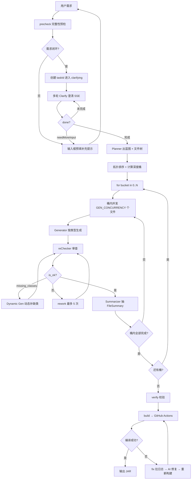
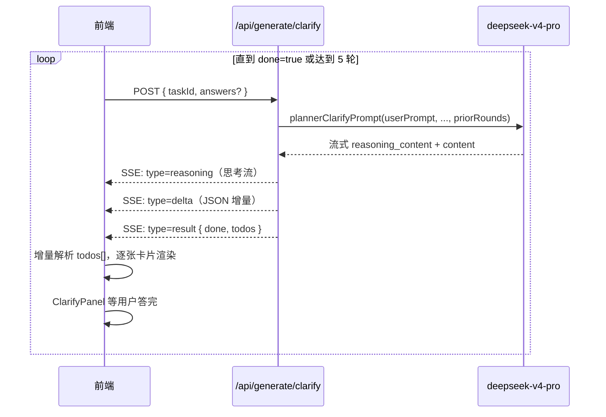
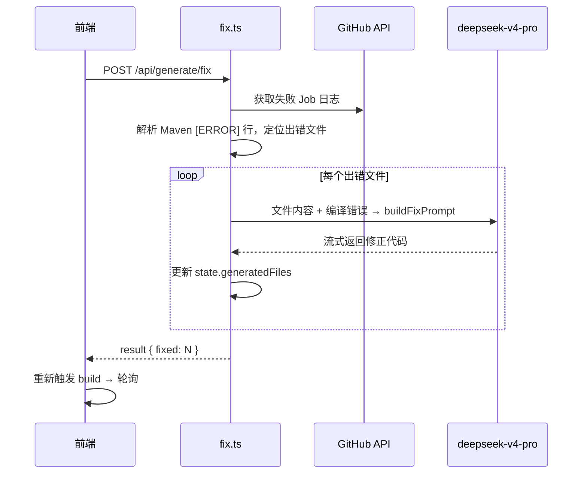

# AI 多阶段工作流

踏海不是「给 LLM 套个壳」，而是一个**多智能体（Multi-Agent）协作系统**：带规划器（Planner）、多个专职生成器（Generators）、审查器（Reviewer）、修复器（Fixer）。整条流水线由前端发起、KV 持久化、SSE 流式回灌进度，任一阶段都可独立重入。

核心契约（每个 Agent 的角色 prompt + 输入/输出 schema）全部硬编码在 `functions/_lib/prompts.ts`。

## Agent 角色一览

| Agent | 模型 | 职责 |
| --- | --- | --- |
| **Pre-checker** | `flash` / `pro` | 判断需求是否逻辑闭环、能否进入规划 |
| **Clarifier** | `pro`（Reasoner） | 多轮 TodoList 形式产出关键决策点 |
| **Planner** | `pro`（Reasoner） | 产出主类蓝图 + 分类型文件树 + 拓扑序 |
| **11 类 Generator** | `flash` | 各按文件类型生成代码 |
| **Reviewer（reChecker）** | `pro` JSON | 静态审查语法/依赖问题，列出缺失类 |
| **Dynamic Generator** | `flash` | 审查指出「缺失类」时按推断类型补生 |
| **Summarizer** | `flash` JSON | 从代码反向抽取结构化 `FileSummary` |
| **Fixer** | `pro`（Reasoner） | Maven 编译失败时按错误日志整文件改写 |

### 模型分工

| 模型 | 用途 | 备注 |
|------|------|------|
| `deepseek-v4-flash` | Generator 主生成、Summarizer、Dynamic Gen、IDE 助手、对话兜底 | 速度快，承担批量生成 |
| `deepseek-v4-pro` | precheck / clarify / planner / reChecker / rework / fix | 自动注入 `reasoning_effort: "high"` + `thinking: { type: "enabled" }`，处理深度推理 |

`functions/api/chat.ts` 与 `stream.ts` 在 `model` 包含 `pro` 时自动注入上述两个字段，调用方只传模型名即可。

## 整体流程



## 第零阶段：需求确认与多轮澄清

进入 Planner 之前，系统先把「模糊一句话」收敛成「逻辑闭环 + 多项关键决策已确认」的精准上下文。

### precheck 完整性预检

用户提交后，前端先调 `/api/chat`（`deepseek-v4-pro`，注入 thinking）判定需求是否闭环（`src/api/deepseek.ts` 的 `precheckPrompt`）：

- `{"complete": true}` → 继续；
- `{"complete": false, "hint": "..."}` → 输入框预填「原始内容 + 补充方向：xxx」，等用户补完再提交；
- 解析失败按「通过」处理，不阻塞流程。

随后 `getInfo`（`flash`）从需求中提取 `coreType` 与 `version`（已写明则无需再问）。

### 多轮 Clarify 澄清

确认核心与版本后，前端调 `/api/generate/plan`（仅传 `userPrompt`/`coreType`/`version`）创建 taskId、进入 `clarifying` 状态，随后循环调 `/api/generate/clarify`（`functions/api/generate/clarify.ts`），直到 `done` 或达到 `MAX_CLARIFY_ROUNDS = 5`。



**关键设计：**

- **Reasoner 流式协议**：`deepseek-v4-pro` 的 chunk 同时含 `delta.reasoning_content`（思考）和 `delta.content`（输出）。前端把 reasoning 写入可折叠的「AI 思考中」区域，content 增量喂给 JSON 解析器。
- **增量卡片渲染**：在 delta 阶段就用深度计数解析器（`generateHandler.ts` 的 `extractCompletedTodos`）抽出已闭合的 todo 推进 ClarifyPanel，消除「思考完→等结果→突然出现」的空档。
- **强制澄清项**（写死在 `plannerClarifyPrompt` 系统消息）：
  - `ui-interaction`（必）：聊天命令 + SendMessage / 聊天命令 + Inventory GUI（其他方案经 `allowCustom` 输入，备注「无法保证质量」）
  - `persistence`（必）：文本 / 二进制；选「文本」后下一轮追问 `text-format`（CSV / TXT / YAML）
  - `growth-curve`（条件）：出现价格/经验/等级/冷却等关键词时必含，options 为函数曲线名（`linear / power2 / power0.5 / log / exp`），前端 `CurveChart.vue` 纯 SVG 渲染对比图
  - 按需：`permission-prefix` / `world-scope` / `external-plugin` / `command-alias` / `message-config` / `reload-strategy`
- **needMoreInput 二次回退**：若 Reasoner 判断需求仍过于模糊，返回 `{ needMoreInput: true, hint }`，前端进入 `awaiting_input` 让用户补充，追加到 `userPrompt` 后继续。
- **轮次硬上限** 5 轮，达到即强制 `done`。

澄清答案（`clarifyRounds`）全部回灌进 `plannerPrompt` 作为「已确认决策」，避免 Planner 自行猜测产生冗余。

## 第一阶段：Planner 规划（主类蓝图 + 文件树）

`clarifyDone === true` 后前端第二次调 `/api/generate/plan`（带 taskId）。后端用 `deepseek-v4-pro`（thinking）产出**两样东西**：主类蓝图 `mainBlueprint` 和带类型的文件树 `files[]`。

### 主类蓝图（MainBlueprint）：消除「主类拼装失败」

LLM 单纯按文件列表写 `Main.java` 时容易漏注册命令、Listener 或 Task。`mainBlueprint` 是 Planner 必须先确定的结构化契约：

```ts
interface MainBlueprint {
    events:   { event, listenerClass, priority? }[];
    commands: { name, executorClass, aliases?, permission? }[];
    tasks:    { taskClass, schedule, periodTicks?, delayTicks?, async? }[];
    services: { managerClass, lifecycle }[];
    config:   { defaultsCopied, files[] };
}
```

Planner 先想清整个系统应有的 events/commands/tasks/services，再据此列文件；蓝图中的类名必须与 `files[].path` 中的类名严格匹配。`plan.ts` 用 `isValidBlueprint` 校验，缺失则返回 422。

### 11 类专职 Generator

每个文件项必须带一个 `generatorType`（`plan.ts` 用 `GENERATOR_TYPES` 校验，非法返回 422）：

```
CommandGen      命令类（同实现 CommandExecutor + TabCompleter，不拆分）
ListenerGen     事件监听类；tag="gui" 时配对 GUI 持有类与点击监听类
TaskGen         BukkitRunnable 调度任务（自身不启动，由 Main 启）
ManagerGen      数据/服务单例（禁止 getInstance 单例反模式）
ConfigGen       资源 yml（plugin.yml / config.yml / lang.yml）
ConfigClassGen  包装 YamlConfiguration 的 Java 配置类
ModelGen        POJO / DTO（不依赖 Bukkit）
EnumGen         枚举
UtilGen         静态工具类
FileRelatedGen  pom.xml / .gitignore 等非 Java 项目文件
MainGen         主类（extends JavaPlugin），强制最后一桶
```

### 拓扑排序 + 深度桶

Planner 输出的每个文件带 `depends`（依赖的文件名）。`plan.ts` 在服务端：

1. **`topoSort`**：按依赖关系排序，保证被依赖的文件 `order` 在前（不可解析的依赖被忽略，退回 order 排序）。
2. **`computeDepths`**：记忆化 DFS 计算每个文件的深度——`depth(f) = 0`（无可解析依赖）或 `1 + max(depth(deps))`；循环依赖兜底返回 0。
3. **划分深度桶**：`buckets[d]` = 该深度的所有文件；**MainGen 强制放到 `maxDepth + 1` 的最后一桶**。

> 同一深度的文件之间保证不互相调用（Planner 被要求把共用 helper 下沉为共同依赖）——这是「桶内可并发」的前提。

## 第二阶段：深度桶并发生成

前端按桶号升序逐个调 `/api/generate/bucket`（`functions/api/generate/bucket.ts`），**桶间串行、桶内并发**。

```mermaid
graph LR
    subgraph 桶 #d（同深度，互不依赖）
        T1[文件1] --> S[makeSemaphore<br/>并发=2]
        T2[文件2] --> S
        T3[文件3] --> S
    end
    S --> G[Generator]
    G --> R[reChecker]
    R --> SUM[Summarizer]
    SUM --> KV[(回填 KV<br/>注入下一桶)]
```

- **并发上限** `makeSemaphore(GEN_CONCURRENCY)`，默认 2，可由 CF 环境变量 `GEN_CONCURRENCY` 覆盖。这是卡在 Cloudflare Workers 免费档约束（单请求 CPU 上限 + 子请求上限）与 DeepSeek 限速之间的甜点值。
- 桶完成后，所有新文件的 `FileSummary` 注入 KV，下一桶的 Generator 能看到上一桶的完整 API。

### dispatchGen：按类型路由专项 prompt

`dispatchGen`（`prompts.ts`）根据 `generatorType` 在通用 `fileGenPrompt` 之上拼接**专项规则**（`specializationBlock`），并为审查器拼接**专项断言**（`checkerSpecializationBlock`）。例如：

- `CommandGen`：强制 `onCommand` + `onTabComplete` 必须在同一类，`onTabComplete` 不得返回 null；不得在文件内 `setExecutor`（注册由 Main 负责）。
- `ListenerGen tag=gui`：必须配对生成「GUI 持有类（InventoryHolder）」与「点击事件监听类」，两者互填 `pairPath`。
- `ManagerGen`：禁止 `getInstance()` 单例反模式，由 Main 持有、其他类经 `Bukkit.getPluginManager().getPlugin()` 反查。
- `MainGen`：把蓝图序列化成「按部就班的 onEnable/onDisable 装配清单」（`formatBlueprintForMain`），模型只需照单写注册代码。

对应地，`reChecker` 的专项断言会按类型核对——如 CommandGen 审查器专门检查 TabCompleter 是否实现。

### FileSummary：跨文件契约传递

每个文件生成后由 Summarizer 反向抽取结构化摘要：

```ts
interface FileSummary {
    path; className; extends; implements;
    publicMethods: { name, params, returns }[];
    publicFields; events; commands; configKeys; description;
}
```

下一文件的 Generator prompt 中被注入 `formatSummaries()` 渲染后的 API 块，并硬约束「你只能调用上面列出的方法，不要假设任何未列出的方法存在」。比直接塞整个文件正文节省约 70% token，且强约束防止幻觉调用。

## 第三阶段：reChecker 审查 + 动态缺失类补全

每个文件生成后经 `reChecker`（`pro`，JSON 模式）审查，输出：

```json
{ "is_ok": false, "reason": "...", "missing_classes": ["WelcomeCommand"] }
```

- **审查通过** → 进入 Summarizer。
- **`missing_classes` 非空（且本文件尚未触发过动态生成）** → 不做 rework（那往往导致 AI 删掉必要引用），而是动态补缺：`inferGeneratorType` 按类名后缀（`*Manager`/`*Listener`/`*Task` 等）推断类型，调对应 Generator 现场补生（单文件最多 `MAX_DYNAMIC_GEN = 3` 个），抽摘要后注入，再用更新后的 summaries 重新审查（不计入 rework 次数）。
- **其他错误** → 普通 rework：把 `reason` 回灌 `reworkPrompt` 让模型重写，最多 `MAX_REWORK = 5` 次。

## 第四阶段：三层错误恢复

| 层级 | 触发条件 | 恢复策略 | 上限 |
| --- | --- | --- | --- |
| 单文件 rework | reChecker `is_ok=false` | 把 `reason` 回灌重写 | `MAX_REWORK = 5` |
| 动态补类 | reChecker 返回 `missing_classes[]` | 按类名推断类型现场补生 | `MAX_DYNAMIC_GEN = 3` |
| 重新规划（replan） | 单文件 5 次仍未过 / 桶内出现异常 | `bucket.ts` 返回 `replan=true`，前端从 Planner 重头来 | `MAX_REPLAN_ATTEMPTS = 2` |
| 编译失败 fix | GitHub Actions `conclusion != success` | 拉 Maven 日志 → Reasoner 整文件改写 → 重提交 | `MAX_FIX_ATTEMPTS = 2` |

**桶级异常隔离**（`bucket.ts`）：单个文件抛错时其他并发任务继续，整桶汇总 `errors[]` 后才决策是否 replan——避免一颗螺丝拖垮整条流水线。即使整桶执行抛异常，也始终发出 `result` 事件（`replan=true`），避免前端拿到 null 卡死。

前端编排（`src/logic/generateHandler.ts`）的 `startGenerate` 把这些回路串起来：clarify 循环 → replan 循环（plan → 按桶并发生成 → verify 补缺 → `buildWithRetry`）。

## 第五阶段：编译失败自动修复

reChecker 基于 AI 审查，无法覆盖所有编译错误（API 版本差异、复杂泛型）。Maven 编译是最终验证，失败后 `/api/generate/fix`（`functions/api/generate/fix.ts`，SSE）：



`buildWithRetry`（`generateHandler.ts`）自动处理「修复-重建」循环，最多 2 次；若 `fixed === 0` 或用尽次数则标记最终错误。

## 服务端 KV 状态机

整个任务的状态活在一个 KV value 里（`TASKS.put(taskId, state, ttl=3600)`），关键字段：`status` / `userPrompt` / `coreType` / `version` / `clarifyRounds` / `clarifyDone` / `mainBlueprint` / `plan` / `buckets` / `fileStatuses` / `currentBucket` / `generatedFiles` / `buildBranch` / `runId` / `artifactId` / `logs`。每个 endpoint 都是纯 read-modify-write KV，前端任意阶段断网/刷新都能恢复到最近一次写入。

## 为什么这样设计？

### 为什么先澄清、再规划？

模糊需求直接出代码，结果常与预期偏差大。多轮 Reasoner 澄清 + TodoList 显式确认，把不确定性前置消化，让 Planner 在「已确认决策」上工作。

### 为什么要主类蓝图 + 11 类 Generator？

让 LLM 自由发挥主类装配经常漏注册；不区分文件类型则约束太泛。结构化 `MainBlueprint` 把主类装配变成「照单填空」，分类型 Generator 让每类文件带上各自的强制项与审查断言，质量显著提升。

### 为什么用深度桶并发，而非全串行或全并发？

全串行慢；全并发会出现「互相依赖的文件同时生成、彼此看不到对方 API」的问题。按依赖深度分桶——桶内文件互不依赖可安全并发，桶间串行保证下游能拿到上游的 `FileSummary`。

### 为什么用结构化摘要而非完整代码？

5 个文件可能超过 1000 行，整文塞 context 会 token 爆炸且诱发幻觉调用。`FileSummary` 只传类名、方法签名、事件等关键信息，信息密度高、token 可控。

## 下一步

- [完整演示](/guide/demo-showcase)：看 AI 如何处理实际案例
- [浏览器 IDE](/features/ide)：生成后如何在线编辑与二次加工
- [系统架构](/technical/architecture)：理解系统如何协调各 Agent
- [API 参考](/technical/api-reference)：plan / clarify / bucket / fix 端点细节
