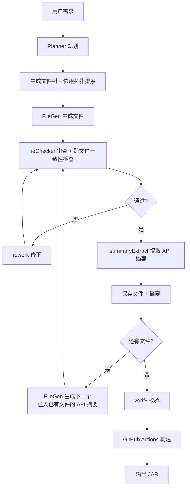

# AI 多阶段工作流

踏海的核心是 AI 驱动的代码生成流程，通过多个专门的 AI 角色协同工作，结合结构化 API 摘要和依赖拓扑排序，保证生成代码的质量和跨文件一致性。

## 整体流程



## 第一阶段：Planner 规划

### 职责

Planner 负责将用户的自然语言需求转换为结构化的项目规划。

### 输入

```json
{
  "userPrompt": "写一个玩家进服时发送欢迎消息的插件",
  "coreType": "PAPER",
  "version": "1.20.6"
}
```

### Prompt 设计

```typescript
const plannerPrompt = `你是 Minecraft 插件项目规划器。
用户需求：${userPrompt}
核心类型：${coreType}
MC 版本：${version}

请生成项目规划，包含：
1. projectName：项目名（驼峰命名）
2. packageName：包名（小写，com.example.xxx）
3. javaVersion：Java 版本（8/11/17/21）
4. files：文件列表，每个文件包含：
   - path：文件路径
   - role：文件职责描述
   - order：生成顺序（数字）
   - depends：依赖的其他文件名数组

输出 JSON 格式。`;
```

### 输出

```json
{
  "projectName": "WelcomePlugin",
  "packageName": "com.example.welcomeplugin",
  "javaVersion": "17",
  "files": [
    {
      "path": "pom.xml",
      "role": "Maven 构建配置",
      "order": 1,
      "depends": []
    },
    {
      "path": "src/main/resources/plugin.yml",
      "role": "插件描述文件",
      "order": 2,
      "depends": []
    },
    {
      "path": "src/main/java/com/example/welcomeplugin/WelcomePlugin.java",
      "role": "插件主类，监听玩家加入事件",
      "order": 3,
      "depends": []
    }
  ]
}
```

### 关键设计

**1. 结构化输出**
- 使用 JSON Mode 强制 AI 输出 JSON
- 避免自然语言描述混入结果

**2. 依赖拓扑排序**
- 每个文件声明 `depends` 字段，列出它依赖的其他文件名
- 服务端使用 Kahn 算法对文件列表进行拓扑排序
- 被依赖的文件先生成，依赖方后生成
- 插件主类（继承 JavaPlugin）始终排在所有 Java 文件最后
- 配置文件优先（pom.xml order=1）

**3. 角色描述**
- 每个文件的 `role` 字段描述职责
- FileGen 生成时作为上下文传入
- 帮助 AI 理解文件的作用

## 第二阶段：FileGen 生成

### 职责

FileGen 负责根据 Planner 的规划，逐个生成文件内容。

### 输入

```typescript
{
  targetFile: {
    path: "src/main/java/com/example/welcomeplugin/WelcomePlugin.java",
    role: "插件主类，监听玩家加入事件"
  },
  context: {
    projectName: "WelcomePlugin",
    packageName: "com.example.welcomeplugin",
    coreType: "PAPER",
    version: "1.20.6",
    javaVersion: "17"
  },
  generatedSummaries: [
    {
      path: "pom.xml",
      description: "Maven 构建配置，定义了 Paper 1.20.6 依赖"
    },
    {
      path: "plugin.yml",
      description: "插件描述文件，main 类为 com.example.welcomeplugin.WelcomePlugin"
    }
  ]
}
```

### 结构化 API 摘要

FileGen 的核心改进是使用结构化 API 摘要替代了原来的简单文本摘要。每个已生成文件的摘要包含：

```typescript
interface FileSummary {
  path: string;
  className?: string;           // 类名
  extends?: string;             // 父类
  implements?: string[];        // 实现的接口
  publicMethods?: {             // 公开方法签名
    name: string;
    params: string;
    returns: string;
  }[];
  publicFields?: string[];      // 公开字段
  events?: string[];            // 监听的事件
  commands?: string[];          // 注册的命令
  configKeys?: string[];        // 配置键
  description?: string;         // 一句话职责描述
}
```

这些摘要在 Prompt 中被格式化为可读的 API 签名块：

```
已生成文件的可用 API：

【src/main/java/.../EconomyManager.java】
  职责：经济系统管理器
  类名：EconomyManager extends JavaPlugin
  公开方法：
    - double getBalance(Player player)
    - boolean withdraw(Player player, double amount)
    - static EconomyManager getInstance()
  监听事件：PlayerJoinEvent
  配置键：starting-balance
```

### Prompt 设计

```typescript
const fileGenPrompt = `你是 Minecraft 插件代码生成器。

项目信息：
- 项目名：${context.projectName}
- 包名：${context.packageName}
- 核心：${context.coreType}
- 版本：${context.version}
- Java 版本：${context.javaVersion}

${formatSummaries(generatedSummaries)}

要求：
1. 只输出文件正文内容，不要包裹 markdown 代码块
2. 确保 import 与已生成文件一致
3. 你只能调用上面列出的类和方法，不要假设任何未列出的方法或类存在
4. 如果需要的功能在已生成文件中不存在，请在当前文件中自行实现
5. 代码简洁实用，注释极少`;
```

### 输出

```java
package com.example.welcomeplugin;

import org.bukkit.event.EventHandler;
import org.bukkit.event.Listener;
import org.bukkit.event.player.PlayerJoinEvent;
import org.bukkit.plugin.java.JavaPlugin;

public class WelcomePlugin extends JavaPlugin implements Listener {

    @Override
    public void onEnable() {
        getServer().getPluginManager().registerEvents(this, this);
        getLogger().info("WelcomePlugin 已启用");
    }

    @EventHandler
    public void onPlayerJoin(PlayerJoinEvent event) {
        event.getPlayer().sendMessage("§a欢迎来到服务器！");
    }
}
```

### 关键设计

**1. 结构化 API 摘要**
- 每个已生成文件由 AI 提取结构化摘要（类名、公开方法签名、事件、命令等）
- 摘要以可读的 API 签名块注入 Prompt，精准传递跨文件上下文
- 明确约束"只能调用已列出的 API"，杜绝虚空调用

**2. 职责明确**
- 每个文件的 `role` 描述清晰
- AI 知道这个文件应该做什么
- 避免生成无关代码

**3. 去除代码围栏**
- AI 可能输出 ` ```java ... ``` `
- 使用 `stripFences()` 函数清理
- 保证文件内容纯净

## 第三阶段：reChecker 审查 + 跨文件一致性检查

### 职责

reChecker 负责审查 FileGen 生成的代码，检查语法错误、逻辑问题，以及跨文件调用一致性。

### 输入

```typescript
{
  filePath: "src/main/java/com/example/.../WelcomePlugin.java",
  content: "package com.example.welcomeplugin;\n\npublic class WelcomePlugin...",
  generatedSummaries: [  // 已生成文件的结构化 API 摘要
    {
      path: "src/main/java/.../EconomyManager.java",
      className: "EconomyManager",
      publicMethods: [
        { name: "getBalance", params: "Player player", returns: "double" }
      ]
    }
  ]
}
```

### Prompt 设计

```typescript
const reCheckerPrompt = `你是 Java 代码审查器。
审查给定文件是否存在明显错误（语法错误、未关闭的括号、错误的 import、
缺少 return、类型不匹配等）。

项目中已生成文件的可用 API：
${formatSummaries(generatedSummaries)}

除上述 API 外，还需检查：当前文件调用的项目内方法是否在上述 API 列表中存在。
如果调用了未列出的项目内方法，视为错误。

只输出 JSON：{"is_ok":true,"reason":""} 或 {"is_ok":false,"reason":"具体错误描述"}`;
```

### 返工机制

如果 reChecker 返回 `is_ok: false`，触发 rework。rework 同样注入已生成文件的 API 摘要，确保修正时不会引入新的虚空调用：

```typescript
const reworkPrompt = `你是代码修正器。
${formatSummaries(generatedSummaries)}
只输出修正后的完整文件正文。
你只能调用上面列出的已生成文件中的类和方法，不要凭空调用不存在的方法。`;
```

修正后的代码再次提交给 reChecker 审查，最多重试 2 次。

### 关键设计

**1. 跨文件一致性检查**
- reChecker 接收已生成文件的结构化 API 摘要（不是完整代码）
- 检查当前文件调用的项目内方法是否真的存在
- 双重防线：FileGen 约束 + reChecker 验证

**2. 摘要而非完整代码**
- 传入的是结构化摘要（类名 + 方法签名），不是完整源码
- token 开销可控，不会因上下文过多产生幻觉

**3. 有限重试**
- 最多修正 2 次
- 避免无限循环
- 如果 2 次仍不通过，保存当前版本并记录日志

## 第四阶段：summaryExtract 摘要提取

### 职责

每个文件生成并通过审查后，由 summaryExtract 提取结构化 API 摘要，供后续文件生成时使用。

### 输入

```typescript
{
  filePath: "src/main/java/.../EconomyManager.java",
  content: "package com.example...\npublic class EconomyManager..."
}
```

### 输出

```json
{
  "className": "EconomyManager",
  "extends": "JavaPlugin",
  "implements": ["Listener"],
  "publicMethods": [
    { "name": "getBalance", "params": "Player player", "returns": "double" },
    { "name": "withdraw", "params": "Player player, double amount", "returns": "boolean" },
    { "name": "getInstance", "params": "", "returns": "EconomyManager" }
  ],
  "publicFields": ["static EconomyManager instance"],
  "events": ["PlayerJoinEvent"],
  "commands": ["/balance"],
  "configKeys": ["starting-balance"],
  "description": "经济系统管理器，提供余额查询和扣款功能"
}
```

### 关键设计

**1. AI 提取而非截断**
- 早期版本使用文件前 3 行截断 120 字符作为摘要，信息量极低
- 现在由 AI 分析完整文件内容，提取公开 API 签名
- 后续文件能精确知道可以调用哪些类和方法

**2. 降级兜底**
- 如果摘要提取失败（AI 返回非 JSON），退回到简单描述
- 不会阻塞整个生成流程

**3. 只提取 public API**
- 不提取 private/protected 方法
- 后续文件只需要知道能调用什么，不需要知道内部实现

## 为什么这样设计？

### 为什么逐文件生成？

一次性输出整个项目会遇到 token 截断、无法控制引用一致性、出错全部重来等问题。逐文件生成配合结构化摘要传递，每个文件独立调用且能精确感知已有文件的 API，是质量和效率的最优平衡。

### 为什么用结构化摘要而非完整代码？

传入完整代码会导致上下文迅速膨胀（5 个文件可能超过 1000 行），大部分内容对当前文件无用。结构化摘要只传递类名、方法签名、事件等关键信息，token 开销可控，且信息密度远高于完整代码。

### 为什么 reChecker 需要跨文件上下文？

早期设计中 reChecker 无上下文，只检查单文件语法。但实践中发现 AI 仍会"虚空调用"不存在的方法，单靠 FileGen 的约束不够。现在 reChecker 接收结构化 API 摘要（不是完整代码），在 token 开销可控的前提下实现跨文件调用验证。

## 实际效果

### 成功率

- **Planner**：95% 以上能正确识别文件结构
- **FileGen**：90% 以上第一次生成即可通过 reChecker
- **reChecker**：发现的问题 80% 以上能在第一次返工中修正

### 常见问题

**Planner 识别错误**：
- 需求描述不清晰（"做一个好用的插件"）
- 解决：提示用户更详细地描述功能

**FileGen 生成错误**：
- 缺少 import 语句（最常见）
- 类名拼写错误
- 解决：reChecker 自动发现并返工

**reChecker 误判**：
- 将正确代码判定为错误（极少见）
- 解决：Maven 构建作为最终验证

## 下一步

- [查看完整演示](/guide/demo-showcase)：看 AI 如何处理实际案例
- [了解架构设计](/technical/architecture)：理解系统如何协调 AI 调用
- [API 参考](/technical/api-reference)：查看 Planner、FileGen、reChecker 的 API
