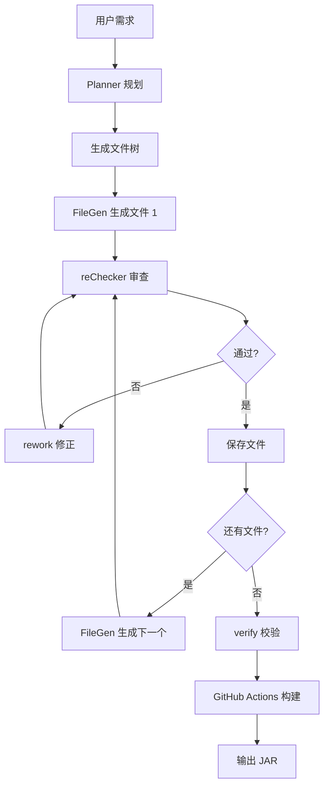

# AI 三阶段工作流

踏海的核心是 AI 驱动的代码生成流程，通过三个专门的 AI 角色协同工作，保证生成代码的质量和一致性。

## 整体流程



## 第一阶段：Planner 规划

### 职责

Planner 负责将用户的自然语言需求转换为结构化的项目规划。

### 输入

```json
{
  "userPrompt": "写一个玩家进服时发送欢迎消息的插件",
  "coreType": "PAPER",
  "version": "1.20.6"
}
```

### Prompt 设计

```typescript
const plannerPrompt = `你是 Minecraft 插件开发专家。
用户需求：${userPrompt}
核心类型：${coreType}
MC 版本：${version}

请生成项目规划，包含：
1. projectName：项目名（驼峰命名）
2. packageName：包名（小写，com.example.xxx）
3. javaVersion：Java 版本（8/17/21）
4. plan：文件列表，每个文件包含：
   - path：文件路径
   - role：文件职责描述
   - order：生成顺序（数字）

输出 JSON 格式。`;
```

### 输出

```json
{
  "projectName": "WelcomePlugin",
  "packageName": "com.example.welcomeplugin",
  "javaVersion": "17",
  "plan": [
    {
      "path": "pom.xml",
      "role": "Maven 构建配置",
      "order": 1
    },
    {
      "path": "src/main/resources/plugin.yml",
      "role": "插件描述文件",
      "order": 2
    },
    {
      "path": "src/main/java/com/example/welcomeplugin/WelcomePlugin.java",
      "role": "插件主类，监听玩家加入事件",
      "order": 3
    }
  ]
}
```

### 关键设计

**1. 结构化输出**
- 使用 JSON Mode 强制 AI 输出 JSON
- 避免自然语言描述混入结果

**2. 文件顺序**
- 配置文件优先（pom.xml、plugin.yml）
- 主类其次
- 依赖类最后
- 保证生成时引用的类已存在

**3. 角色描述**
- 每个文件的 `role` 字段描述职责
- FileGen 生成时作为上下文传入
- 帮助 AI 理解文件的作用

## 第二阶段：FileGen 生成

### 职责

FileGen 负责根据 Planner 的规划，逐个生成文件内容。

### 输入

```typescript
{
  targetFile: {
    path: "src/main/java/com/example/welcomeplugin/WelcomePlugin.java",
    role: "插件主类，监听玩家加入事件"
  },
  context: {
    projectName: "WelcomePlugin",
    packageName: "com.example.welcomeplugin",
    coreType: "PAPER",
    version: "1.20.6",
    javaVersion: "17"
  },
  generatedFiles: [
    {
      path: "pom.xml",
      summary: "Maven 配置，定义了 Paper 1.20.6 依赖"
    },
    {
      path: "plugin.yml",
      summary: "插件描述，main 类为 com.example.welcomeplugin.WelcomePlugin"
    }
  ]
}
```

### Prompt 设计

```typescript
const fileGenPrompt = `你是 Minecraft 插件开发专家。

当前任务：生成 ${targetFile.path}
文件职责：${targetFile.role}

项目信息：
- 项目名：${context.projectName}
- 包名：${context.packageName}
- 核心：${context.coreType}
- 版本：${context.version}
- Java 版本：${context.javaVersion}

已生成文件：
${generatedFiles.map(f => `- ${f.path}: ${f.summary}`).join('\n')}

要求：
1. 生成完整的文件内容
2. 确保 import 语句正确
3. 遵循 Java 命名规范
4. 代码简洁清晰

直接输出文件内容，不要包含任何解释。`;
```

### 输出

```java
package com.example.welcomeplugin;

import org.bukkit.event.EventHandler;
import org.bukkit.event.Listener;
import org.bukkit.event.player.PlayerJoinEvent;
import org.bukkit.plugin.java.JavaPlugin;

public class WelcomePlugin extends JavaPlugin implements Listener {

    @Override
    public void onEnable() {
        getServer().getPluginManager().registerEvents(this, this);
        getLogger().info("WelcomePlugin 已启用");
    }

    @EventHandler
    public void onPlayerJoin(PlayerJoinEvent event) {
        event.getPlayer().sendMessage("§a欢迎来到服务器！");
    }
}
```

### 关键设计

**1. 增量上下文**
- 只传入已生成文件的**摘要**，不传完整代码
- 摘要包含关键信息（类名、方法名、配置键）
- 节省 token，避免上下文过长

**2. 职责明确**
- 每个文件的 `role` 描述清晰
- AI 知道这个文件应该做什么
- 避免生成无关代码

**3. 去除代码围栏**
- AI 可能输出 ` ```java ... ``` `
- 使用 `stripFences()` 函数清理
- 保证文件内容纯净

```typescript
function stripFences(raw: string): string {
    return raw.replace(/^```[\w]*\n?/, "").replace(/\n?```$/, "");
}
```

## 第三阶段：reChecker 审查

### 职责

reChecker 负责审查 FileGen 生成的代码，发现语法错误和逻辑问题。

### 输入

```typescript
{
  filePath: "src/main/java/com/example/welcomeplugin/WelcomePlugin.java",
  content: "package com.example.welcomeplugin;\n\npublic class WelcomePlugin..."
}
```

### Prompt 设计

```typescript
const reCheckerPrompt = `你是代码审查专家。

文件：${filePath}
内容：
${content}

请审查代码，检查：
1. 语法错误（缺少分号、括号不匹配等）
2. import 语句是否完整
3. 类名、方法名是否符合规范
4. 基本逻辑是否合理

输出 JSON 格式：
{
  "is_ok": true/false,
  "reason": "通过原因 或 问题描述"
}`;
```

### 输出示例

**通过审查**：
```json
{
  "is_ok": true,
  "reason": "代码格式正确，import 完整，逻辑清晰"
}
```

**不通过审查**：
```json
{
  "is_ok": false,
  "reason": "缺少 import org.bukkit.event.EventHandler"
}
```

### 返工机制

如果 reChecker 返回 `is_ok: false`，触发 rework：

```typescript
const reworkPrompt = `原代码存在问题：${review.reason}

原代码：
${content}

请修正代码，确保：
1. 解决上述问题
2. 保持原有功能
3. 不引入新问题

直接输出修正后的代码。`;
```

修正后的代码再次提交给 reChecker 审查，最多重试 2 次。

### 关键设计

**1. 无上下文审查**
- reChecker 只看当前文件，不传入其他文件
- 职责单一：检查语法和基本逻辑
- 跨文件一致性由 FileGen 的摘要机制保证

**2. 快速响应**
- 传入内容少，AI 响应快
- 避免因上下文过多产生幻觉

**3. 有限重试**
- 最多修正 2 次
- 避免无限循环
- 如果 2 次仍不通过，保存当前版本并记录日志

## 为什么这样设计？

### 为什么逐文件生成？

**对比一次性生成**：
```
Prompt: 生成整个项目
AI: 输出 pom.xml + plugin.yml + 3 个 Java 类
```

**问题**：
- Token 限制可能截断输出
- 无法控制文件间引用一致性
- 出错时只能全部重来
- 用户无法看到进度

**逐文件生成的优势**：
- 每个文件独立调用，不受 token 限制
- 已生成文件的摘要作为上下文，保证一致性
- 单个文件出错可以返工，不影响其他文件
- 用户实时看到每个文件的生成进度

### 为什么 reChecker 无上下文？

**对比传入所有文件**：
```
Prompt: 审查 WelcomePlugin.java，已生成文件：pom.xml（完整内容）、plugin.yml（完整内容）
```

**问题**：
- 上下文过长，消耗大量 token
- AI 可能被无关信息干扰
- 响应速度慢

**无上下文的优势**：
- 职责单一：只检查当前文件能否编译
- 速度快，token 消耗少
- 稳定性高，不会因上下文过多产生幻觉

跨文件一致性已经由 FileGen 的摘要机制保证，reChecker 不需要重复检查。

### 为什么用摘要而非完整代码？

**对比传入完整代码**：
```
已生成文件：
- pom.xml: <project>...</project>（200 行）
- plugin.yml: name: WelcomePlugin...（50 行）
```

**问题**：
- 上下文迅速膨胀，5 个文件可能超过 1000 行
- 大部分内容对当前文件无用
- 浪费 token，增加成本

**摘要的优势**：
```
已生成文件：
- pom.xml: Maven 配置，定义了 Paper 1.20.6 依赖
- plugin.yml: 插件描述，main 类为 com.example.welcomeplugin.WelcomePlugin
```

- 只传递关键信息（类名、方法名、配置键）
- 上下文保持简洁
- AI 能获取足够信息生成正确的 import 和引用

## 实际效果

### 成功率

- **Planner**：95% 以上能正确识别文件结构
- **FileGen**：90% 以上第一次生成即可通过 reChecker
- **reChecker**：发现的问题 80% 以上能在第一次返工中修正

### 常见问题

**Planner 识别错误**：
- 需求描述不清晰（"做一个好用的插件"）
- 解决：提示用户更详细地描述功能

**FileGen 生成错误**：
- 缺少 import 语句（最常见）
- 类名拼写错误
- 解决：reChecker 自动发现并返工

**reChecker 误判**：
- 将正确代码判定为错误（极少见）
- 解决：Maven 构建作为最终验证

## 下一步

- [查看完整演示](/guide/demo-showcase)：看 AI 如何处理实际案例
- [了解架构设计](/technical/architecture)：理解系统如何协调 AI 调用
- [API 参考](/technical/api-reference)：查看 Planner、FileGen、reChecker 的 API
