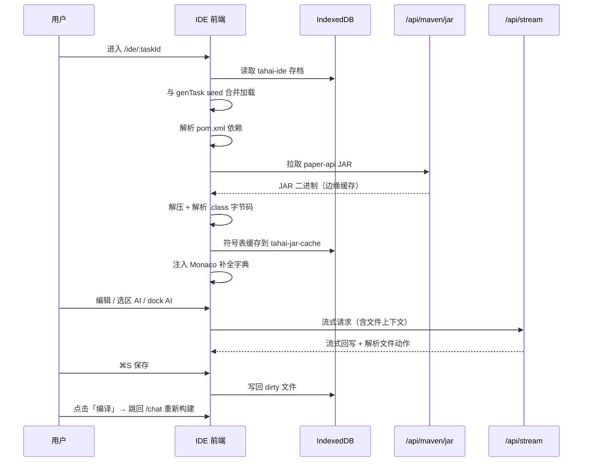

# 浏览器内 IDE

生成出的插件项目不只是「下载 JAR」就结束了。踏海内置了一个**完全运行在浏览器里的轻量 IDE**（`src/ide/`），让用户在生成完成后直接在线浏览、编辑、用 AI 二次加工代码，再回到流水线重新编译——无需本地安装 IDEA、JDK 或任何依赖。

整套 IDE 没有后端语言服务（LSP），所有「智能」都在前端完成：**直接在浏览器里解析 Maven JAR 中的 Java `.class` 字节码**，抽出符号表喂给 Monaco 做补全。

## 入口

IDE 是一个独立路由（`src/router.ts`）：

```
/ide/:taskId?
```

- 从生成结果进入时，自动以 `genTask.files`（已生成文件 + 各自的 `generatorType` / `role`）作为种子（seed）加载。
- 直接访问 `/ide`（无 taskId、无生成结果）时，加载一份内置 demo 工程（pom.xml + Main + JoinListener + plugin.yml + config.yml），方便体验。
- IDE 内点击「编译」会保存全部改动并跳回 `/chat`，把编辑后的文件接回构建流水线。

## 整体布局

```
┌─────────────────────────────────────────────────────────┐
│  toolbar   task <id>   ● N 未保存   paper-api 87% ▸       │  ← 顶部工具栏 + pom 加载进度
├──────────────┬──────────────────────────────────────────┤
│              │  TabBar:  Main.java │ plugin.yml │ ...     │
│  FileTree    ├──────────────────────────────────────────┤
│  （分类/目录）│                                            │
│   ⟷ 可拖拽   │         EditorPanel (Monaco)              │
│              │           ┌── 选区浮层 (AI) ──┐            │
│              │           └───────────────────┘            │
├──────────────┴──────────────────────────────────────────┤
│  ▁▁▁ 底部 AI 聊天 dock（dormant / hint / open 三态）▁▁▁  │
├──────────────────────────────────────────────────────────┤
│  statusbar  行/列   已保存   UTF-8  LF  JAVA  N files     │
└──────────────────────────────────────────────────────────┘
```

- **侧栏宽度**可拖拽（`180~600px`，`useIDEStore.setSidebarWidth` 约束）。
- **快捷键**：`⌘S` 保存全部、`⌘W` 关闭当前标签、`Esc` 收起 AI dock。

## 文件系统：种子 + IndexedDB 持久化

文件状态由 `useIDEStore.ts` 统一管理，并落盘到 **IndexedDB**（库 `tahai-ide`，对象仓库 `files`，主键 `[taskId, path]`）。

- **加载合并策略**（`loadFromTask`）：以本次传入的 seed 为基础，逐文件查 IndexedDB 中该 `taskId` 的存档：
  - 已有存档 → 用存档内容覆盖，并按内容是否与 seed 不同标记 `dirty`；
  - 无存档 → 用 seed 内容；
  - 存档里有、seed 里没有的文件（如 AI 后续新建的） → 也并入列表。
- **保存**（`saveAll`，`⌘S` 或工具栏按钮）：只写回 `dirty` 的文件，写完清除 dirty 标记。
- 编辑器内容变化即标记 `dirty`，工具栏与状态栏实时显示「N 个未保存」。

> 刷新页面不会丢失：只要 `taskId` 不变，IndexedDB 里的编辑结果会重新合并回来。

### 双视图文件树

`FileTree.vue` 支持两种组织方式，右上角一键切换：

| 视图 | 说明 |
| --- | --- |
| **代码分类**（默认） | 按文件的 `generatorType` 分组，11 类各有专属颜色徽标：主类 / 命令 / 事件监听 / 调度任务 / 数据·服务 / 配置类 / 资源配置 / 数据模型 / 枚举 / 工具类 / 项目文件 |
| **项目结构** | 传统的 Maven 目录树（`src/main/java/...`），文件夹可折叠 |

顶部带搜索框，输入关键字时强制展开所有分组/目录并按路径过滤。

## 智能补全：浏览器内解析 `.class` 字节码

这是 IDE 最核心的部分。没有任何后端参与，补全字典完全由前端从 Maven JAR 现场解析。

### 1. 从 pom.xml 提取依赖

`usePomParser.ts` 用浏览器原生 `DOMParser` 解析 `pom.xml`，收集 `<dependencies>` / `<dependencyManagement>`，并解析 `${...}` 属性占位符。只有以下 groupId 的依赖会被当作「值得拉取补全」的 API JAR（其余如 Guava、Commons 跳过，`test` scope 也跳过）：

```
io.papermc.paper · io.papermc · com.destroystokyo.paper · org.spigotmc · org.bukkit
```

### 2. 通过 Worker 代理拉取 JAR

浏览器无法直接拉 Maven 仓库（CORS 未开放），因此走 Pages Function 代理 `GET /api/maven/jar`（`functions/api/maven/jar.ts`）：

- 按 groupId 选仓库（PaperMC / SpigotMC / Maven Central 兜底，白名单防滥用）；
- 自动解析 `-SNAPSHOT` 版本：读 `maven-metadata.xml` 拿到 `timestamp`/`buildNumber` 拼出真实文件名；
- 边缘缓存 6 小时，响应带 `Access-Control-Allow-Origin: *`。

前端 `fetchJar` 带下载进度回调，工具栏实时显示 `paper-api 87%`。

### 3. 手写 `.class` 字节码解析器

`useJarSymbols.ts` 用 JSZip 解压 JAR，对每个 `.class` 文件运行一个**零依赖的字节码读取器** `ClassReader`，严格按 JVM Class 文件格式解析：

```
magic 0xCAFEBABE → 常量池 → access_flags → this_class
→ super_class → interfaces → fields → methods → attributes(全跳过)
```

- 只保留 `public` 且非 `synthetic` 的类与成员，跳过内部类（含 `$`）、`<init>`/`<clinit>`/`lambda$`；
- 解析方法/字段描述符（`(Ljava/lang/String;I)V` → `void m(String s, int i)`），并据参数类型生成 Monaco snippet 占位符（`Player` → `player` 等友好参数名）；
- `expandInheritance` 沿 `super_class` + 接口递归合并方法集（带深度上限与环检测），让子类补全也能看到父类/接口方法。

解析结果按依赖坐标缓存进 IndexedDB（库 `tahai-jar-cache`），下次同坐标秒开。工具栏 pom 标签会经历 `下载中 → 解析 N 类 → ✓ N 类` 三态。

### 4. 字典合并 + Monaco 补全

`useBukkitDict.ts` 维护两套字典并合并：

- **硬编码字典**：常用的 `Player` / `Bukkit` / `JavaPlugin` / `World` / `ItemStack` / `ChatColor` / 各类 Event / `BukkitScheduler` 等，带中文说明和精心设计的 snippet（例如 `hasPermission("${1:permission}")`）。即使没有 pom 也能用。
- **动态字典**：来自上一步的 JAR 解析。同名类按包名优先级择优（`org.bukkit` / `io.papermc` > `org.spigotmc` > `java.*`）。

`registerBukkitCompletion` 注册一个 Java 补全 provider，覆盖三种场景：

| 触发 | 行为 |
| --- | --- |
| `@注解名` | 列出所有注解类（`@EventHandler` / `@Override` / `@Nullable` …） |
| `变量.成员` | 扫描当前文件的「类型 变量名」声明推断接收者类型，列出该类（含继承）的方法/字段 |
| 大写开头单词 | 列出所有类名供 import/引用 |

成员访问场景下，`scanLocalTypes` 用正则扫描当前文件把 `Player p;` 这样的局部变量映射到类型，从而对 `p.` 给出 `Player` 的补全。

### 5. 跨文件跳转定义

`Cmd/Ctrl + 左键`点击标识符时（`EditorPanel.onMouseDown`），`findDefinition` 在所有打开文件里用正则匹配类/方法/字段声明，命中后自动切换标签并把光标定位过去。

## 代码编辑器

`EditorPanel.vue` 基于 **Monaco Editor**（VS Code 同款内核，通过 `vite-plugin-monaco-editor` 打包 worker）：

- 自定义主题 `tahai-dark`（`useMonacoTheme.ts`）：wheat 关键字、蓝色类型、紫色数字，与全站毛玻璃风格统一；
- 按扩展名自动识别语言：Java / Kotlin / XML / YAML / JSON / Markdown / Properties / Groovy …；
- 开启括号配色、缩进参考线、Sticky Scroll、平滑光标等；
- 面包屑显示文件名 + `role`（生成时的职责描述）+ 语言标签。

## AI 助手

IDE 内置两个独立的 AI 入口（均走 `/api/stream`，`deepseek-v4-flash`，逻辑在 `useIDEChat.ts`）：

### 底部聊天 dock

`BottomChatDock` 有 `dormant / hint / open` 三态：鼠标移到 IDE 底部约 110px 内浮出提示，点击展开。它是「项目级」助手——prompt 注入了**当前 IDE 文件列表 + 当前打开文件正文**，AI 必须先在回复第一行声明意图：

```
INTENT:chat     纯问答/讨论，不动文件
INTENT:create   新建文件
INTENT:edit     修改已有文件
```

意图不是 `chat` 时，每个文件追加一个 `FILE <create|edit> <path>` + 代码块。`parseResponse` 解析后**直接把文件写入 IDE**（`upsertFile`，单次最多 3 个文件、永远输出完整文件而非 diff）。

### 选区浮层

在编辑器里选中 ≥4 个字符的代码，会在选区旁弹出浮层（`SelectionPopup.vue`，自动在选区上/下方择优定位）。提供 5 个快捷动作 + 自定义提问：

| 动作 | 类型 |
| --- | --- |
| 📖 解释 | 解释类——只回 2-4 句中文，不出代码 |
| ✨ 重构 / 🩹 修 Bug / ⚡ 优化 / 💬 加注释 | 修改类——只回完整可替换代码块 |

`askWithSelection` 的 system prompt 严格区分两类任务。**修改类**结果会被自动 `executeEdits` 替换原选区（支持 `⌘Z` 撤销）；**解释类**结果就地展示。任意结果都可「进入主聊天」推入底部 dock 继续追问。

## 数据流



## 为什么这样设计？

### 为什么在浏览器里解析字节码，而不是接 LSP？

完整的 Java 语言服务（jdt.ls 等）需要常驻 JVM 进程，与「Cloudflare Pages 静态托管 + Serverless Functions」的零运维架构完全冲突。而插件开发真正高频的诉求是「Bukkit/Paper API 有哪些方法、签名是什么」——这恰好可以通过解析 API JAR 的字节码符号表满足。`.class` 格式稳定、解析成本低（一次解析缓存复用），用纯前端就能覆盖 80% 的补全场景。

### 为什么补全字典要硬编码 + 动态合并？

JAR 解析依赖 pom 正确、网络可达、版本可解析；任一环节失败就没有补全。硬编码字典保证**即使离线或没有 pom，最常用的 API 也立即可用**，并能附带 JAR 里没有的中文说明和 snippet。动态字典则补全长尾 API。两者按成员名 union、硬编码优先。

### 为什么 AI 直接写文件而不是给 diff？

让模型只输出完整文件，避免了 diff 定位/应用的复杂度与错位风险，配合「一次最多 3 个文件」的约束，在小型插件场景下足够可靠，也便于直接落盘到 IndexedDB。

## 下一步

- [AI 工作流](/features/ai-workflow)：了解这些文件最初是如何被生成的
- [系统架构](/technical/architecture)：IDE 在整体系统中的位置
- [API 参考](/technical/api-reference)：`/api/maven/jar` 与 `/api/stream` 端点细节
