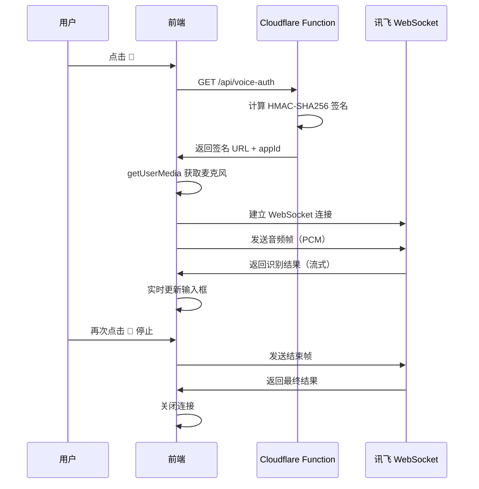

# 语音输入

踏海支持语音输入功能，通过讯飞 WebSocket 实时语音识别（STT），让用户解放双手描述需求。

## 技术方案

**前端录音 + 讯飞 WebSocket 流式识别 + 云端鉴权**



## 云端鉴权

讯飞 API 需要 HMAC-SHA256 签名，密钥不能暴露在前端。

### 签名计算（`functions/api/voice-auth.ts`）

```typescript
export const onRequestGet: PagesFunction<Env> = async (context) => {
  const { XFYUN_APP_ID, XFYUN_API_KEY, XFYUN_API_SECRET } = context.env;

  // 1. 生成 RFC1123 格式时间
  const date = new Date().toUTCString();

  // 2. 拼接签名原文（注意换行符）
  const LF = String.fromCharCode(10);
  const signatureOrigin =
    "host: iat-api.xfyun.cn" + LF +
    "date: " + date + LF +
    "GET /v2/iat HTTP/1.1";

  // 3. HMAC-SHA256 签名
  const encoder = new TextEncoder();
  const key = await crypto.subtle.importKey(
    "raw",
    encoder.encode(XFYUN_API_SECRET.trim()),
    { name: "HMAC", hash: "SHA-256" },
    false,
    ["sign"]
  );
  const signature = await crypto.subtle.sign(
    "HMAC",
    key,
    encoder.encode(signatureOrigin)
  );
  const signatureBase64 = btoa(String.fromCharCode(...new Uint8Array(signature)));

  // 4. 拼接 authorization 原文
  const authorizationOrigin =
    `api_key="${XFYUN_API_KEY.trim()}", ` +
    `algorithm="hmac-sha256", ` +
    `headers="host date request-line", ` +
    `signature="${signatureBase64}"`;

  const authorization = btoa(authorizationOrigin);

  // 5. 构造 WebSocket URL
  const url =
    `wss://iat-api.xfyun.cn/v2/iat` +
    `?authorization=${encodeURIComponent(authorization)}` +
    `&date=${encodeURIComponent(date)}` +
    `&host=${encodeURIComponent("iat-api.xfyun.cn")}`;

  return new Response(JSON.stringify({ url, appId: XFYUN_APP_ID }), {
    headers: {
      "Content-Type": "application/json",
      "Cache-Control": "no-store"  // 防止缓存过期签名
    }
  });
};
```

**关键点**：
- 换行符使用 `String.fromCharCode(10)` 而非 `"\n"`，避免转译问题
- 环境变量 `.trim()` 防止隐藏空白导致签名不匹配
- 响应头 `Cache-Control: no-store` 防止前端缓存过期签名

## 前端录音采集

### 获取麦克风权限

```typescript
// voiceInput.ts
export async function startVoice() {
  // 1. 获取签名 URL
  const { url, appId } = await fetch("/api/voice-auth").then(r => r.json());

  // 2. 获取麦克风（必须在用户手势的同步调用链中）
  mediaStream = await navigator.mediaDevices.getUserMedia({
    audio: {
      sampleRate: 16000,  // 讯飞要求 16kHz
      channelCount: 1     // 单声道
    }
  });

  // 3. 建立 WebSocket 连接
  ws = new WebSocket(url);
  ws.onopen = () => setupAudio(appId);
  ws.onmessage = handleMessage;
  ws.onerror = cleanup;
  ws.onclose = cleanup;
}
```

**注意**：`getUserMedia` 必须在用户手势的直接调用链中，否则浏览器会静默拒绝。

### 音频采集和编码

```typescript
function setupAudio(appId: string) {
  // 创建 AudioContext
  audioCtx = new AudioContext({ sampleRate: 16000 });
  await audioCtx.resume();  // 非手势上下文中可能 suspended

  const source = audioCtx.createMediaStreamSource(mediaStream!);

  // ScriptProcessor 采集 PCM（bufferSize 必须是 2 的幂）
  scriptNode = audioCtx.createScriptProcessor(4096, 1, 1);
  scriptNode.onaudioprocess = (e) => {
    const float32 = e.inputBuffer.getChannelData(0);
    const pcm16 = float32ToPcm16(float32);
    sendFrame(pcm16, appId);
  };

  source.connect(scriptNode);
  scriptNode.connect(audioCtx.destination);
}
```

**Float32 转 PCM16**：
```typescript
function float32ToPcm16(float32: Float32Array): ArrayBuffer {
  const pcm16 = new Int16Array(float32.length);
  for (let i = 0; i < float32.length; i++) {
    const s = Math.max(-1, Math.min(1, float32[i]));
    pcm16[i] = s < 0 ? s * 0x8000 : s * 0x7FFF;
  }
  return pcm16.buffer;
}
```

## 数据帧格式

### 首帧（status: 0）

```typescript
function sendFrame(pcm: ArrayBuffer, appId: string) {
  const base64Audio = btoa(String.fromCharCode(...new Uint8Array(pcm)));

  if (frameIndex === 0) {
    // 首帧包含完整配置
    ws.send(JSON.stringify({
      common: { app_id: appId },
      business: {
        language: "zh_cn",
        domain: "iat",
        accent: "mandarin",
        dwa: "wpgs"  // 开启动态修正
      },
      data: {
        status: 0,
        format: "audio/L16;rate=16000",
        encoding: "raw",
        audio: base64Audio
      }
    }));
  } else {
    // 后续帧只发送音频数据
    ws.send(JSON.stringify({
      data: {
        status: 1,
        format: "audio/L16;rate=16000",
        encoding: "raw",
        audio: base64Audio
      }
    }));
  }
  frameIndex++;
}
```

### 结束帧（status: 2）

```typescript
export function stopVoice() {
  if (ws && ws.readyState === WebSocket.OPEN) {
    ws.send(JSON.stringify({ data: { status: 2 } }));
  }
  cleanup();
}
```

## 流式结果解析

讯飞返回的结果包含 `pgs` 字段（动态修正标记）：

| pgs 值 | 含义 | 处理方式 |
|--------|------|----------|
| `apd` | 追加 | 直接追加到结果 |
| `rpl` | 替换 | 删除 `rg[0]` 到 `rg[1]` 范围的句子，替换为当前结果 |

**解析逻辑**：
```typescript
const resultMap = new Map<number, string>();

function handleMessage(event: MessageEvent) {
  const msg = JSON.parse(event.data);
  if (msg.code !== 0) return;

  const data = msg.data;
  if (data.status === 2) {
    // 识别结束
    cleanup();
    return;
  }

  const result = JSON.parse(data.result);
  const ws = result.ws;

  for (const item of ws) {
    const { cw, pgs, rg, sn } = item;
    const text = cw.map((w: any) => w.w).join("");

    // 替换模式：删除旧句子
    if (pgs === "rpl" && rg) {
      for (let i = rg[0]; i <= rg[1]; i++) {
        resultMap.delete(i);
      }
    }

    // 更新当前句子
    resultMap.set(sn, text);
  }

  // 按句子编号排序拼接
  const keys = [...resultMap.keys()].sort((a, b) => a - b);
  voiceText.value = keys.map(k => resultMap.get(k)).join("");
}
```

## 输入框实时更新

```typescript
// ChatPage.vue
const inputText = ref("");
let voiceBaseText = "";

function toggleVoice() {
  if (isRecording.value) {
    stopVoice();
  } else {
    voiceBaseText = inputText.value;  // 记录基础文本
    startVoice();
  }
}

// 监听语音识别结果，实时拼接
watch(voiceText, (t) => {
  if (isRecording.value) {
    inputText.value = voiceBaseText + t;
  }
});
```

**效果**：
- 用户输入"写一个"，点击语音按钮
- 说"传送插件"
- 输入框实时显示"写一个传送插件"

<!-- 截图：语音输入过程，输入框实时更新 -->

## 连接终止

| 场景 | 触发方式 | 行为 |
|------|----------|------|
| 用户手动停止 | 再次点击 🎤 | 发送 status:2 帧，停止录音 |
| 引擎识别结束 | 返回 data.status === 2 | 自动清理，回调最终文本 |
| 超时 | 60s 无数据或 10s 静默 | 服务端主动断开 |
| 网络错误 | WebSocket error | onerror 触发清理 |

**清理逻辑**：
```typescript
function cleanup() {
  if (hasFired) return;
  hasFired = true;

  // 停止录音
  if (scriptNode) {
    scriptNode.disconnect();
    scriptNode = null;
  }
  if (audioCtx) {
    audioCtx.close();
    audioCtx = null;
  }
  if (mediaStream) {
    mediaStream.getTracks().forEach(track => track.stop());
    mediaStream = null;
  }

  // 关闭 WebSocket
  if (ws) {
    ws.close();
    ws = null;
  }

  isRecording.value = false;
}
```

**`hasFired` 标记**：确保 `onmessage`/`onclose`/`onerror` 都可能触发清理时，只执行一次。

## 常见问题

### 麦克风权限被拒绝

**原因**：
- 用户拒绝授权
- 非 HTTPS 环境（localhost 除外）
- 浏览器不支持 `getUserMedia`

**解决**：
- 提示用户授权
- 确保生产环境使用 HTTPS
- 检测浏览器兼容性

### 识别结果不准确

**原因**：
- 环境噪音过大
- 麦克风质量差
- 方言口音

**解决**：
- 提示用户在安静环境使用
- 调整 `accent` 参数（mandarin/cantonese 等）
- 使用外置麦克风

### WebSocket 连接失败

**原因**：
- 签名过期（超过 5 分钟）
- 环境变量配置错误
- 网络问题

**解决**：
- 检查服务器时间是否准确
- 验证环境变量是否正确
- 查看浏览器控制台错误信息

## 技术亮点

1. **云端鉴权**：密钥不暴露在前端，安全性高
2. **流式识别**：实时反馈，用户体验好
3. **动态修正**：`wpgs` 模式自动纠正识别错误
4. **增量拼接**：支持在已有文本基础上追加语音输入
5. **资源清理**：连接终止时自动释放麦克风和 WebSocket

## 下一步

- [查看前端实现](/features/frontend-highlights)：了解语音输入如何集成到 UI
- [查看 API 参考](/technical/api-reference)：了解 `/api/voice-auth` 接口详情
- [查看架构设计](/technical/architecture)：了解整体系统设计
