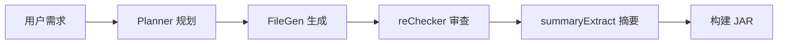

# 项目介绍

## 背景与痛点

Minecraft 插件开发是一个充满创意的领域，但对于新手和非专业开发者来说，门槛相当高：

### 技术门槛
- **Java 语言**：需要掌握面向对象编程、泛型、注解等概念
- **Bukkit/Paper API**：庞大的 API 体系，事件系统、权限系统、配置系统等
- **构建工具**：Maven 或 Gradle 的配置和依赖管理
- **开发环境**：IDEA/Eclipse 配置、JDK 版本选择、插件调试

### 学习成本
- 从零开始学习需要数周甚至数月
- 官方文档分散，社区教程质量参差不齐
- 不同 MC 版本和核心（Bukkit/Spigot/Paper/Forge/Fabric）API 差异大
- 调试困难，需要搭建测试服务器

### 实际场景
很多服主和玩家有简单的插件需求：
- "玩家进服时发送欢迎消息"
- "禁止在特定区域使用某些物品"
- "定时清理掉落物"
- "自定义传送点系统"

这些需求功能简单，但实现起来仍需完整的开发流程。

## 解决方案

**踏海 MC DevTool** 通过 AI 技术降低插件开发门槛，让任何人都能用自然语言描述需求，自动生成可用的插件。

### 核心价值

**1. 零门槛开发**
- 无需学习 Java 和 Bukkit API
- 无需配置开发环境
- 用自然语言描述需求即可

**2. 全自动流程**
- AI 自动分析需求，生成开发步骤
- 自动生成完整项目（Java 代码 + 配置文件 + Maven 构建）
- 自动触发云端构建，输出可用 JAR

**3. 质量保证**
- reChecker 自动审查代码，发现语法错误和逻辑问题
- 自动修正，最多重试 2 次
- Maven 编译验证，确保代码可运行

**4. 多核心支持**
- 支持 Paper、Bukkit、Spigot、Forge、Fabric
- 覆盖 MC 1.7 到 1.21 版本
- 自动选择合适的 Java 版本（8/17/21）

## 技术创新

### AI 多阶段工作流

**Planner**：分析需求，生成文件树、角色描述和依赖拓扑（depends），主类排最后
**FileGen**：逐文件生成代码，注入已生成文件的结构化 API 摘要（类名、方法签名、事件等），约束只能调用已存在的 API
**reChecker**：审查每个文件，含跨文件调用一致性检查，发现问题自动返工
**summaryExtract**：由 AI 提取每个文件的结构化 API 摘要，供后续文件使用

[详细了解 AI 设计 →](/features/ai-workflow)

### 云原生架构

- **Cloudflare Pages Functions**：无服务器后端，按需计费
- **KV 存储**：任务状态持久化，TTL 自动清理
- **GitHub Actions**：云端 Maven 构建，零维护成本
- **前端驱动**：分步调用 API，实时进度反馈

[详细了解架构设计 →](/technical/architecture)

### 现代化前端

- **Vue 3 Composition API**：响应式状态管理，无需 Vuex/Pinia
- **Canvas 粒子背景**：方块粒子动画，营造 MC 氛围
- **毛玻璃 UI**：backdrop-filter 实现，深色主题友好
- **语音输入**：讯飞 WebSocket STT，解放双手

[详细了解前端实现 →](/features/frontend-highlights)

## 适用场景

### 服主快速开发
服主有简单的插件需求，但不想花时间学习开发，可以用踏海快速生成。

### 学习参考
开发者可以用踏海生成基础代码框架，然后在此基础上学习和修改。

### 原型验证
快速验证插件创意是否可行，生成原型后再决定是否深入开发。

### 教学演示
教师可以用踏海演示插件开发流程，让学生理解项目结构和 API 使用。

## 局限性

踏海适合生成**功能明确、逻辑简单**的插件，对于以下场景可能不适用：

- **复杂业务逻辑**：如经济系统、RPG 系统、小游戏等
- **性能优化**：AI 生成的代码可能不是最优解
- **高度定制化**：需要深度集成其他插件或数据库
- **长期维护**：生成的代码需要人工审查和维护

对于这些场景，建议使用踏海生成基础框架，然后由专业开发者进一步完善。

## 下一步

- [快速开始](/guide/quick-start)：5 分钟上手体验
- [查看演示](/guide/demo-showcase)：完整的维护插件生成案例
- [了解 AI 设计](/features/ai-workflow)：深入理解 AI 工作流程
