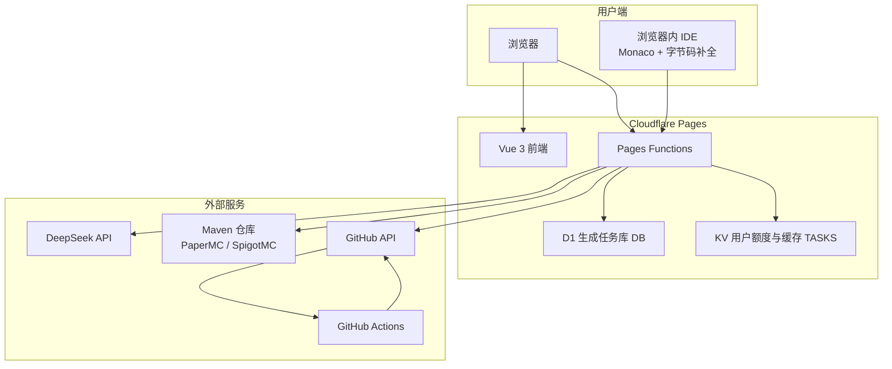
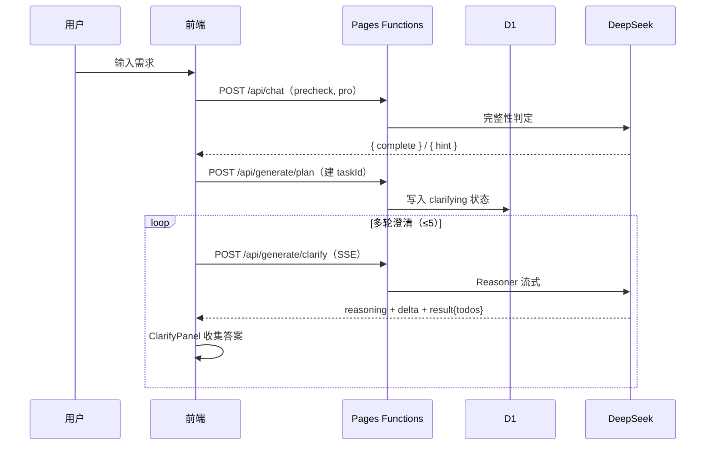
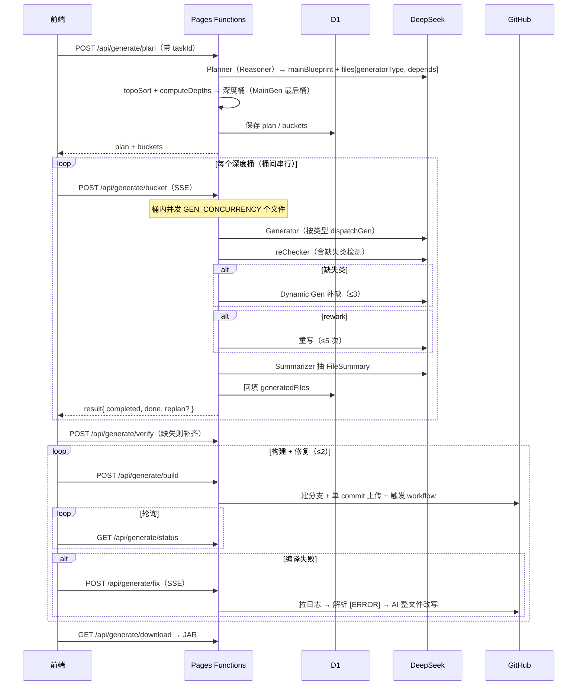

# 系统架构

踏海采用云原生架构，前后端分离，无需自建服务器，所有服务托管在 Cloudflare 和 GitHub 平台。

## 整体架构



## 三层架构

### 1. 前端层（Vue 3 + Vite）

**职责**：用户交互、对话流程控制、生成流程编排、实时进度展示、浏览器内 IDE。

**技术栈**：Vue 3 Composition API（`<script setup>`）、TypeScript、Vue Router、原生 Canvas（粒子背景）、Monaco Editor（IDE）、IndexedDB（IDE 持久化）。

**核心文件**：
```
src/
├── pages/
│   ├── HomePage.vue          # 首页（粒子背景 + 打字机）
│   └── ChatPage.vue          # 对话页（需求输入 + 澄清 + 生成进度）
├── components/
│   ├── ClarifyPanel.vue      # 多轮 TodoList 卡片
│   ├── CurveChart.vue        # 纯 SVG 5 种增长曲线对比图
│   ├── GenerateProgress.vue  # 按生成器类型分组的文件 + 行内 streaming
│   └── StepRender / cubeBackground / glassCard / ...
├── logic/
│   ├── chatState.ts          # ChatBlock + draft 上下文模型
│   ├── chatHandler.ts        # precheck → getInfo → getTodoList 编排
│   ├── generateState.ts      # GenTask 响应式状态 + Clarify/ExtraPrompt resolver
│   ├── generateHandler.ts    # 桶遍历 + SSE 路由 + replan/fix 回路
│   └── sessionPersist.ts     # localStorage 持久化 + 中断态恢复
├── ide/                      # 浏览器内 IDE 模块（见「浏览器 IDE」）
│   ├── pages/IDEPage.vue
│   ├── components/            # EditorPanel / FileTree / TabBar / BottomChatDock / SelectionPopup
│   └── composables/           # useIDEStore / useJarSymbols / useBukkitDict / usePomParser / useIDEChat / useMonacoTheme
├── api/deepseek.ts           # 前端调 /api/chat /api/stream 的薄封装 + 业务 preset
└── router.ts                 # 路由（/ /chat /ide/:taskId?）
```

### 2. 后端层（Cloudflare Pages Functions）

**职责**：API 端点、AI 调用封装、任务状态管理、密钥安全保护、Maven 仓库代理。

**技术栈**：TypeScript、Cloudflare Workers Runtime、D1、KV。

```
functions/
├── api/
│   ├── chat.ts                # 非流式 LLM 代理（model 含 pro 时注入 thinking）
│   ├── stream.ts              # SSE LLM 代理
│   ├── maven/jar.ts           # Maven 仓库 JAR / metadata 代理（IDE 补全用）
│   └── generate/
│       ├── plan.ts            # Planner（双模式：建 task + 出蓝图/文件树/深度桶）
│       ├── clarify.ts         # Clarifier（Reasoner SSE，多轮）
│       ├── bucket.ts          # 单桶并发生成 + reChecker + 动态补缺（主路径）
│       ├── file.ts            # 单文件生成（legacy，仅供补缺/重新规划）
│       ├── verify.ts          # 文件完整性校验
│       ├── build.ts           # 上传 GitHub + 触发 Actions
│       ├── status.ts          # 轮询构建状态
│       ├── fix.ts             # 编译失败的 Reasoner 修复回路（SSE）
│       └── download.ts        # JAR 代理下载
└── _lib/
    ├── prompts.ts             # 所有 Agent 的角色 prompt + schema 契约
    └── github.ts              # GitHub REST 工具集
```

### 3. 构建层（GitHub Actions）

**职责**：Maven 编译、JAR 打包、Artifact 上传。Worker 中无法运行 Maven，编译外包给独立仓库 `minecraft-dev-workflow` 的预置 `workflow_dispatch` workflow，接收 `branch` 与 `java_version` 参数。

## 数据流

### 对话与澄清



### 规划 + 桶并发生成 + 构建



> 生成完成后，用户也可进入 `/ide/:taskId` 在浏览器内编辑文件，再点「编译」跳回 `/chat` 重新构建。

### 模型主动 Learning

Planner、Generator、Reviewer、Reworker 与 Fixer 的 DeepSeek 请求都会附带原生 `learn_public_api` function tool。DS 负责判断何时缺少精确的版本化公开 API 事实；Pages Functions 将工具参数转换为原子 `KnowledgeNeed`，校验公开命名空间或任务已声明的外部依赖，再由 `/api/learning/start|step|status` 完成资料发现、抓取和证据验证。完成后，原始 assistant `reasoning_content`、`tool_calls` 与验证结果会按 DeepSeek function-calling 协议回放，模型从中断点继续。

Learning job 与模型请求 ID、需求指纹和任务状态栅栏绑定，结果写入 D1 公共知识缓存；运行时限制每段模型对话最多两轮工具调用。前端只负责跨 Worker 请求推进 job 和恢复连接，不判断是否需要学习。

## 核心设计决策

### 为什么用 Cloudflare Pages？

| 对比项 | Cloudflare Pages | 传统服务器 |
|--------|------------------|-----------|
| 部署 | Git push 自动部署 | 手动配置 Nginx/PM2 |
| 扩展 | 自动扩展 | 手动负载均衡 |
| 成本 | 免费额度充足 | 购买 VPS |
| CDN | 全球加速 | 单独配置 |
| Functions | 内置 Serverless | 自建 API |

### 为什么使用 D1 + KV 混合存储？

生成任务快照和任务成本是整条流水线中最频繁的读写，存入 D1 并以主键索引访问；大 JSON 按块拆分，避免 D1 单行大小限制，逻辑 TTL 到期后由新任务创建时分批清理。用户资料、月额度、订单、赞助和 Skill 缓存仍保留在 KV，因为它们低频且天然适合键值读取。旧 KV 任务在首次访问时惰性迁移，D1 未绑定或暂时不可用时则安全回退 KV。

### 为什么用 GitHub Actions 而非自建编译服务器？

Workers 不支持运行 Maven；自建编译服务器需维护 Java 环境且有安全风险。GitHub Actions 零维护、隔离、免费，2-5 分钟延迟对「生成一个插件」的场景可接受。

### 为什么前端驱动而非服务端编排？

Cloudflare Pages Functions 单请求有 CPU/时长上限，而整个流程需要数分钟。前端按阶段分别调用各端点：

- 每个请求都在限制内完成（尤其桶请求一次性流式输出，避免长连接超时）；
- 前端在每步之间更新 UI，实时看到进度；
- 某步失败可重试（replan / fix），不必从头开始；
- D1 任务状态机 + 前端 localStorage 保证刷新可恢复。

## 安全设计

所有敏感密钥存 Cloudflare 环境变量，前端无法访问：

| 密钥 | 用途 |
|------|------|
| `DEEPSEEK_API_KEY` | DeepSeek API 认证 |
| `GITHUB_PAT` | GitHub API（对 `minecraft-dev-workflow` 有 repo + workflow 权限）|

- **Maven 代理白名单**：`maven/jar.ts` 仅允许 PaperMC / SpigotMC / Maven Central，防止 Worker 被当作任意 GET 代理。
- **GitHub 临时分支**：每次构建建 `build-<taskId>` 分支，成功后立即删除。

## 性能优化

### 前端

1. **Canvas 粒子背景**：`requestAnimationFrame` 跟随刷新率，页面不可见时自动暂停，`scale=0` 跳过计算。
2. **响应式状态**：无 Vuex/Pinia，直接 import 响应式对象。
3. **代码分割**：Vue Router 懒加载（首页 / 对话页 / IDE 分别打包）。
4. **IDE 字节码缓存**：解析过的 JAR 符号表缓存进 IndexedDB，同坐标秒开。

### 后端

1. **结构化 API 摘要**：Generator 传入已生成文件的 `FileSummary`（类名、方法签名、事件）而非完整代码，节省约 70% token。
2. **桶内并发**：同深度文件经 `makeSemaphore(GEN_CONCURRENCY)` 并发生成（默认 2），桶间串行保证依赖顺序。
3. **D1 状态机**：任务状态逻辑有效期 1 小时；每个 bucket 最多一次分块状态写，LLM usage 每请求最多一次原子成本累计。

## 可扩展性

- **新增 MC 核心**：在前端核心选项与 `prompts.ts` 的 Planner/Generator prompt 中扩展（路线图含 Forge / Fabric 的 Generator 子模板分支）。
- **替换 AI 模型**：各端点的模型名集中在 `functions/api/**`，`chat.ts`/`stream.ts` 按模型名注入 thinking。
- **新增 Generator 类型**：在 `prompts.ts` 的 `GENERATOR_TYPES` + `specializationBlock` + `checkerSpecializationBlock` 三处对应扩展。

## 下一步

- [AI 工作流](/features/ai-workflow)：深入理解各 Agent
- [浏览器 IDE](/features/ide)：IDE 模块实现
- [API 参考](/technical/api-reference)：完整端点文档
- [开发部署](/technical/development)：本地开发与部署流程
