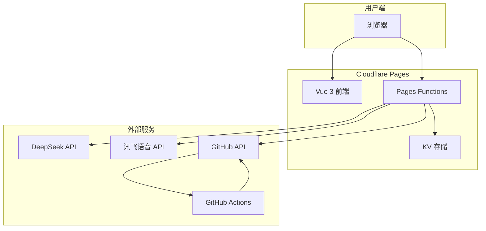
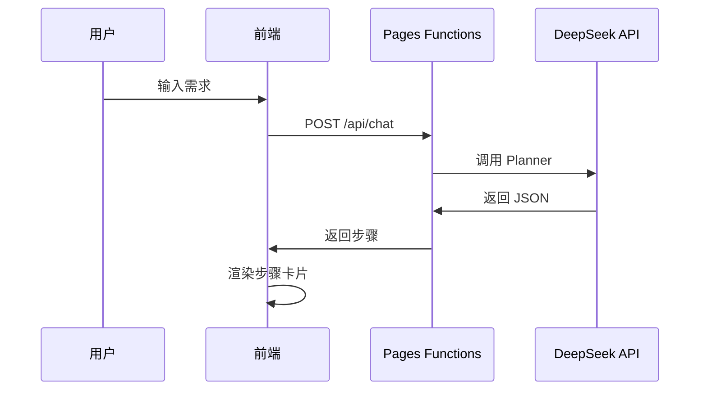
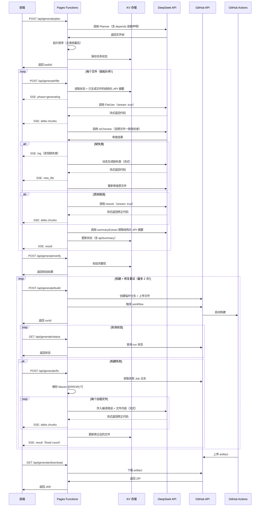

# 系统架构

踏海采用云原生架构，前后端分离，无需自建服务器，所有服务托管在 Cloudflare 和 GitHub 平台。

## 整体架构



## 三层架构

### 1. 前端层（Vue 3 + Vite）

**职责**：
- 用户交互界面
- 对话流程控制
- 生成流程编排
- 实时进度展示

**技术栈**：
- Vue 3 Composition API
- TypeScript
- Vue Router
- 原生 Canvas（粒子背景）

**核心文件**：
```
src/
├── pages/
│   ├── HomePage.vue          # 首页（粒子背景 + 打字机效果）
│   └── ChatPage.vue           # 对话页（需求输入 + 步骤展示）
├── components/
│   ├── StepRender.vue         # 步骤渲染
│   └── GenerateProgress.vue   # 生成进度面板
├── logic/
│   ├── chatState.ts           # 对话状态
│   ├── chatHandler.ts         # 对话逻辑
│   ├── generateState.ts       # 生成状态
│   ├── generateHandler.ts     # 生成逻辑
│   └── voiceInput.ts          # 语音输入
└── router.ts                  # 路由配置
```

### 2. 后端层（Cloudflare Pages Functions）

**职责**：
- API 端点实现
- AI 调用封装
- 任务状态管理
- 密钥安全保护

**技术栈**：
- TypeScript
- Cloudflare Workers Runtime
- KV 存储

**API 端点**：
```
functions/
├── api/
│   ├── chat.ts                # 非流式对话
│   ├── stream.ts              # 流式对话
│   ├── voice-auth.ts          # 语音鉴权
│   └── generate/
│       ├── plan.ts            # Planner 规划
│       ├── file.ts            # FileGen 流式生成 (SSE)
│       ├── verify.ts          # 文件校验
│       ├── build.ts           # 触发构建
│       ├── fix.ts             # 编译失败自动修复 (SSE)
│       ├── status.ts          # 构建状态
│       └── download.ts        # 下载 JAR
└── _lib/
    ├── prompts.ts             # Prompt 模板
    └── github.ts              # GitHub API 封装
```

### 3. 构建层（GitHub Actions）

**职责**：
- Maven 编译
- JAR 打包
- Artifact 上传

**Workflow 配置**：
```yaml
# .github/workflows/maven.yml
name: Build Plugin

on:
  workflow_dispatch:
    inputs:
      branch:
        required: true
      java_version:
        required: true

jobs:
  build:
    runs-on: ubuntu-latest
    steps:
      - uses: actions/checkout@v3
        with:
          ref: ${{ github.event.inputs.branch }}

      - uses: actions/setup-java@v3
        with:
          java-version: ${{ github.event.inputs.java_version }}
          distribution: 'temurin'

      - name: Build with Maven
        run: mvn clean package

      - uses: actions/upload-artifact@v3
        with:
          name: plugin-jar
          path: target/*.jar
```

## 数据流

### 对话流程



### 生成流程



## 核心设计决策

### 为什么用 Cloudflare Pages？

| 对比项 | Cloudflare Pages | 传统服务器 |
|--------|------------------|-----------|
| 部署 | Git push 自动部署 | 需手动配置 Nginx/PM2 |
| 扩展 | 自动扩展，无需配置 | 需手动配置负载均衡 |
| 成本 | 免费额度充足 | 需购买 VPS |
| CDN | 全球 CDN 加速 | 需单独配置 |
| Functions | 内置 Serverless | 需自建 API 服务 |

### 为什么用 KV 而非 D1？

| 对比项 | KV | D1（SQL） |
|--------|------|-----------|
| 数据模型 | 键值对，存 JSON | 关系表 |
| 适合场景 | 临时状态，TTL 自动清理 | 持久化业务数据 |
| 复杂度 | `put` / `get` / `delete` | 需要建表、写 SQL |
| 本地开发 | wrangler 内置 | 需要额外配置 |

生成任务是临时性的（1 小时后自动过期），不需要查询、关联或聚合。KV 的键值模型完全够用，且 TTL 自动清理免去了手动垃圾回收。

### 为什么用 GitHub Actions 而非自建编译服务器？

| 方案 | 优点 | 缺点 |
|------|------|------|
| GitHub Actions | 零维护，隔离，免费 | 延迟较高（排队+启动） |
| 自建编译服务器 | 快 | 需维护 Java 环境，安全风险 |
| Cloudflare Workers 内编译 | 最快 | Workers 不支持运行 Maven |

GitHub Actions 的 2-5 分钟延迟对于"生成一个插件项目"的场景可以接受。用户不会频繁生成，而每次生成 AI 代码本身就需要 1-2 分钟。

### 为什么前端驱动而非服务端编排？

**服务端编排**（一个 API 从头执行到底）的问题：
- Cloudflare Pages Functions 有 30 秒超时限制
- 整个流程可能需要 5-10 分钟
- 用户无法看到中间进度

**前端驱动**（按步调用 6 个 API）的优势：
- 每个 API 调用都在超时限制内完成
- 前端在每步之间更新 UI，用户实时看到进度
- 某一步失败可以重试，不需要从头开始
- KV 保存中间状态，刷新页面后可以恢复

## 安全设计

### 密钥保护

所有敏感密钥存储在 Cloudflare 环境变量中，前端无法访问：

| 密钥 | 用途 | 存储位置 |
|------|------|---------|
| `DEEPSEEK_API_KEY` | DeepSeek API 认证 | Cloudflare 环境变量 |
| `GITHUB_PAT` | GitHub API 认证 | Cloudflare 环境变量 |
| `XFYUN_APP_ID` | 讯飞应用 ID | Cloudflare 环境变量 |
| `XFYUN_API_KEY` | 讯飞 API Key | Cloudflare 环境变量 |
| `XFYUN_API_SECRET` | 讯飞 API Secret | Cloudflare 环境变量 |

### 语音鉴权

讯飞 WebSocket 需要 HMAC-SHA256 签名，签名计算在服务端完成：

```typescript
// functions/api/voice-auth.ts
const signature = await crypto.subtle.sign("HMAC", key, data);
const url = `wss://iat-api.xfyun.cn/v2/iat?authorization=${authorization}...`;
return new Response(JSON.stringify({ url, appId }));
```

前端只获得签名后的 URL，无法获取 API Secret。

### GitHub 权限

GitHub PAT 权限最小化：
- 只授予 `repo` 权限
- 只能访问 `minecraft-dev-workflow` 仓库
- 临时分支构建完成后立即删除

## 性能优化

### 前端优化

1. **Canvas 粒子背景**
   - `requestAnimationFrame` 自动跟随刷新率
   - 页面不可见时自动暂停
   - `scale` 为 0 时跳过计算

2. **响应式状态**
   - 无 Vuex/Pinia，减少包体积
   - 直接 import 响应式对象，零开销

3. **代码分割**
   - Vue Router 懒加载
   - 首页和对话页分别打包

### 后端优化

1. **结构化 API 摘要**
   - FileGen 传入已生成文件的结构化摘要（类名、公开方法签名、事件、命令等），而非完整代码
   - 由 AI 提取摘要，信息密度远高于简单截断
   - 节省 token，同时精准传递跨文件依赖信息

2. **并发控制**
   - 文件生成串行执行，避免 AI 调用冲突
   - 前端可并行调用多个 API（plan + verify）

3. **KV 缓存**
   - 任务状态缓存 1 小时
   - 避免重复计算

## 可扩展性

### 支持新的 MC 核心

在 `chatHandler.ts` 中添加核心类型：

```typescript
export const CORE_TYPES = ["PAPER", "BUKKIT", "SPIGOT", "FORGE", "FABRIC", "SPONGE"];
```

在 `prompts.ts` 中添加对应的 Prompt 模板。

### 支持新的 AI 模型

在 `functions/api/generate/file.ts` 中修改 API 端点：

```typescript
const DEEPSEEK_URL = "https://api.deepseek.com/v1/chat/completions";
// 改为其他模型的 API
```

### 支持其他构建工具

在 GitHub Actions workflow 中替换 Maven 为 Gradle：

```yaml
- name: Build with Gradle
  run: ./gradlew build
```

## 下一步

- [了解 AI 工作流](/features/ai-workflow)：深入理解 Planner、FileGen、reChecker
- [查看 API 参考](/technical/api-reference)：完整的 API 文档
- [开发部署指南](/technical/development)：本地开发和部署流程
